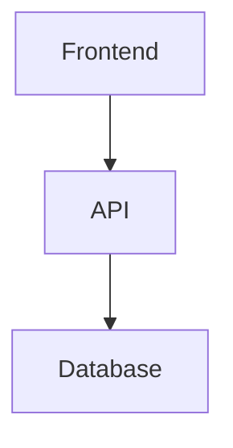

# 📄 Documentation Template for Krawl Project

> **Meta-Document:** This template defines the standard structure and formatting conventions for all Krawl project documentation.

---

## 📋 Document Header Template

```markdown
# [Emoji] [Document Type]: [Title]

> **Purpose:** [One sentence describing what this document covers and who it's for]

**Version:** 0.1.0-MVP  
**Last Updated:** 2025-10-31  
**Status:** [Draft | Active | Archived]  
**Owner:** [Team/Person responsible]

---
```

### Header Guidelines

| Element | Rule | Example |
|---------|------|---------|
| **Emoji** | Optional, use for visual clarity | 🗺️ 🚀 🔐 📊 |
| **Document Type** | Required for formal docs | Project Brief, API Documentation, Security Plan |
| **Title** | Use "Krawl" or "Krawl [Context]" | Krawl MVP, Krawl API |
| **Purpose** | Required in blockquote | Brief one-liner about the doc's purpose |
| **Version** | Use Semantic Versioning | 1.0.0, 1.1.0, 2.0.0 |
| **Date Format** | ISO 8601 | 2025-10-28 |
| **Status** | One of three states | Draft, Active, Archived |

---

## 📑 Document Structure

### Standard Structure for All Documents

```markdown
# [Header as above]

> **Purpose:** [Purpose statement]

**Metadata Block**

---

## 📋 Table of Contents
[Only for documents > 200 lines or with 5+ major sections]

1. [Section 1](#section-1)
2. [Section 2](#section-2)
...

---

## 1. Introduction/Overview
[Context, background, scope]

---

## 2. Main Content Sections
[Organized by topic]

---

## 3. Implementation Details
[If applicable: technical specs, code examples]

---

## 4. References & Related Docs
[Links to related documentation]

---

## 📝 Changelog
[For living documents - track major updates]

| Version | Date | Changes | Author |
|---------|------|---------|--------|
| 1.0.0 | 2025-10-28 | Initial version | Team |

---

## 📚 Related Documents
- [Related Doc 1](./related-doc.md)
- [Related Doc 2](./related-doc-2.md)

---

*Document maintained by [Team Name] • Last reviewed: [Date]*
```

---

## 🎯 Document Type-Specific Templates

### A. Planning Documents
**Examples:** Project Brief, Proposal, Scope of Work, Milestones

```markdown
# 🎯 [Document Type]: [Title]

> **Purpose:** [Planning document purpose]

**Version:** 0.1.0-MVP  
**Last Updated:** 2025-10-31  
**Status:** Active

---

## 1. Overview
[High-level summary]

## 2. Objectives/Goals
[What we're trying to achieve]

## 3. Scope
[What's included/excluded]

## 4. Timeline/Milestones
[When things happen]

## 5. Success Metrics
[How we measure success]

## 6. Stakeholders
[Who's involved]

---

*Planning document for [Project Phase]*
```

### B. Technical Documentation
**Examples:** API Docs, Database Schema, System Design

```markdown
# 🔧 [Document Type]: [Title]

> **Purpose:** [Technical specification purpose]

**Version:** 0.1.0-MVP  
**Last Updated:** 2025-10-31  
**Status:** Active  
**Tech Stack:** [Relevant technologies]

---

## 📋 Table of Contents
[Required for technical docs]

---

## 1. Overview
[System/component overview]

## 2. Architecture/Design
[High-level design, diagrams]

## 3. Specifications
[Detailed technical specs]

### 3.1 Component A
[Details]

### 3.2 Component B
[Details]

## 4. Code Examples
[Implementation examples]

```language
// Code block with proper language tag
```

## 5. Integration Points
[How it connects to other systems]

## 6. Testing & Validation
[How to verify it works]

---

## 📝 Changelog

| Version | Date | Changes | Author |
|---------|------|---------|--------|
| 1.0.0 | 2025-10-28 | Initial spec | Dev Team |

---

*Technical documentation maintained by Engineering Team*
```

### C. Process/Guide Documents
**Examples:** Testing Plan, Security Plan, Deployment Guide

```markdown
# 📘 [Document Type]: [Title]

> **Purpose:** [Process/guide purpose]

**Version:** 0.1.0-MVP  
**Last Updated:** 2025-10-31  
**Status:** Active

---

## 1. Introduction
[Why this process exists]

## 2. Prerequisites
[What you need before starting]

## 3. Step-by-Step Process

### Step 1: [Action]
[Details, commands, screenshots]

✅ **Validation:** [How to verify this step]

### Step 2: [Action]
[Details]

✅ **Validation:** [How to verify this step]

## 4. Troubleshooting
[Common issues and solutions]

## 5. Best Practices
[Tips and recommendations]

---

*Process guide maintained by [Team] • Updated quarterly*
```

### D. Design Documents
**Examples:** UI/UX Design System, Wireframes, Brand Guidelines

```markdown
# 🎨 [Document Type]: [Title]

> **Purpose:** [Design documentation purpose]

**Version:** 0.1.0-MVP  
**Last Updated:** 2025-10-31  
**Status:** Active

---

## 1. Design Principles
[Core design philosophy]

## 2. Visual Elements

### 2.1 Colors
[Color palette with hex codes]

### 2.2 Typography
[Font choices, sizes, hierarchy]

### 2.3 Spacing
[Margin/padding system]

## 3. Components
[UI components or design elements]

## 4. Usage Guidelines
[Do's and Don'ts with examples]

✅ **Do:** [Example]
❌ **Don't:** [Example]

## 5. Assets & Resources
[Where to find design files]

---

*Design documentation maintained by Design Team*
```

---

## ✍️ Formatting Standards

### Headings

```markdown
# H1 - Document Title (Only one per document)
## H2 - Major Sections
### H3 - Subsections
#### H4 - Minor divisions (use sparingly)
```

**Rules:**
- Use H1 only for document title
- Use H2 for major sections with horizontal rules before
- Number H2 sections for long technical docs (1., 2., 3.)
- Don't skip heading levels

---

### Horizontal Rules

```markdown
---
```

**When to Use:**
- After document header/metadata
- Between major H2 sections
- Before footer/changelog
- **Don't** use between every subsection

---

### Lists

**Unordered Lists:**
```markdown
- Top-level item
  - Nested item (2 spaces)
    - Deeply nested (4 spaces)
```

**Ordered Lists:**
```markdown
1. First item
2. Second item
   1. Nested (3 spaces)
   2. Nested item
```

**Task Lists:**
```markdown
- [ ] Incomplete task
- [x] Completed task
```

---

### Tables

```markdown
| Column 1 | Column 2 | Column 3 |
|----------|----------|----------|
| Data A   | Data B   | Data C   |
| Data D   | Data E   | Data F   |
```

**Rules:**
- Use for structured data comparison
- Keep headers brief
- Align consistently (use pipes)
- Add blank line before and after

---

### Code Blocks

````markdown
```language
// Always specify language
const example = "code";
```
````

**Supported Languages:**
- `javascript`, `typescript`, `java`, `kotlin`
- `sql`, `bash`, `json`, `yaml`
- `markdown`, `plaintext`

---

### Blockquotes

```markdown
> **Purpose:** Use for important callouts or document purpose

> **Note:** Additional context or warnings
```

**When to Use:**
- Document purpose statement
- Important warnings
- Key insights
- Quotes from stakeholders

---

### Emoji Guidelines

**Recommended Emojis by Section:**

| Section Type | Emoji | Example |
|--------------|-------|---------|
| Overview/Intro | 📋 🎯 📖 | `## 📋 Overview` |
| Goals/Objectives | 🎯 ⭐ | `## 🎯 Goals` |
| Technical/Code | 🔧 ⚙️ 💻 | `## 🔧 Technical Specs` |
| Design/UI | 🎨 ✨ | `## 🎨 Design System` |
| Security | 🔐 🛡️ | `## 🔐 Security` |
| Database | 🗄️ 💾 | `## 🗄️ Schema` |
| Testing | 🧪 ✅ | `## 🧪 Testing` |
| Features | ✨ 🚀 | `## ✨ Features` |
| Users/People | 👥 👤 | `## 👥 Users` |
| Timeline | 📅 ⏱️ | `## 📅 Timeline` |
| Money/Budget | 💰 💵 | `## 💰 Budget` |
| Warnings | ⚠️ 🚨 | `> ⚠️ **Warning:**` |
| Success | ✅ ✔️ | `✅ Completed` |
| Failure/Don't | ❌ ⛔ | `❌ Don't do this` |

**Rules:**
- Use emojis for visual scanning, not decoration
- One emoji per H2 section header (optional)
- Keep consistent within a document
- Don't overuse (max 1-2 per line)

---

### Links

**Internal Links:**
```markdown
[Link Text](./relative-path.md)
[Section Link](#section-heading)
```

**External Links:**
```markdown
[Link Text](https://example.com)
```

**Rules:**
- Use descriptive link text
- Relative paths for internal docs
- Group related links in "Related Documents" section

---

## 📏 Document Length Guidelines

| Document Type | Target Length | TOC Required |
|---------------|---------------|--------------|
| **Brief** | 100-200 lines | No |
| **Standard** | 200-500 lines | Optional |
| **Comprehensive** | 500-1000 lines | Yes |
| **Reference** | 1000+ lines | Yes |

---

## 🔄 Version Control

### Semantic Versioning

```
MAJOR.MINOR.PATCH

1.0.0 → 1.0.1 → 1.1.0 → 2.0.0
```

| Version Type | When to Increment | Example |
|--------------|-------------------|---------|
| **MAJOR** | Breaking changes, complete rewrites | Database schema changes, API breaking changes |
| **MINOR** | New features, significant additions | Adding new section, new feature documentation |
| **PATCH** | Bug fixes, typos, minor clarifications | Fixing typos, updating dates, small corrections |

### Changelog Format

```markdown
## 📝 Changelog

| Version | Date | Changes | Author |
|---------|------|---------|--------|
| 1.1.0 | 2025-10-30 | Added new API endpoints section | Backend Team |
| 1.0.1 | 2025-10-29 | Fixed typos in examples | QA Team |
| 1.0.0 | 2025-10-28 | Initial document | Project Lead |
```

---

## 📂 File Naming Conventions

### Document Names

```
[category]-[description].md

✅ Good:
- project-brief.md
- api-documentation.md
- database-schema.md
- testing-plan.md
- ui-ux-design-system.md

❌ Bad:
- ProjectBrief.md
- API_Documentation.md
- db schema.md
- TestingPLAN.MD
```

**Rules:**
- All lowercase
- Use hyphens, not underscores or spaces
- Be descriptive but concise
- Use `.md` extension

### Document Categories

```
Planning:      project-*, scope-*, milestone-*
Technical:     api-*, database-*, system-*, tech-*
Design:        ui-*, brand-*, wireframe-*, design-*
Process:       testing-*, security-*, deployment-*
Research:      user-*, market-*, competitor-*
Content:       content-*, seo-*, copy-*
```

---

## 🎨 Visual Elements

### Diagrams

**Prefer:**
- Mermaid diagrams (renders in GitHub/GitLab)
- ASCII art for simple structures
- Links to external tools (Figma, Lucidchart) for complex diagrams

```markdown
## Architecture Diagram



**Alternative:**

```

### ASCII Art

```markdown
┌─────────────┬──────────────┬──────────┐
│   To Do     │ In Progress  │   Done   │
└─────────────┴──────────────┴──────────┘
```

**Use for:**
- Simple wireframes
- Kanban boards
- Process flows
- Directory structures

---

## ✅ Quality Checklist

Before committing documentation, verify:

### Content
- [ ] Purpose statement is clear
- [ ] All metadata fields are filled
- [ ] Content is accurate and up-to-date
- [ ] Examples are relevant and tested
- [ ] Technical details are correct

### Structure
- [ ] Follows appropriate template
- [ ] Heading hierarchy is logical
- [ ] TOC matches actual sections (if present)
- [ ] Sections flow logically
- [ ] Related docs are linked

### Formatting
- [ ] Markdown syntax is correct
- [ ] Code blocks have language tags
- [ ] Tables are properly formatted
- [ ] Links work correctly
- [ ] Emoji usage is consistent

### Accessibility
- [ ] Link text is descriptive
- [ ] Alt text for images (if any)
- [ ] No color-only indicators
- [ ] Clear section headings

### Maintenance
- [ ] Version number updated
- [ ] Last updated date is current
- [ ] Changelog entry added (if applicable)
- [ ] Owner/maintainer identified

---

## 🔗 Related Templates & Resources

### Standard Templates in This Repo
- `project-brief-template.md` - For new project documents
- `api-endpoint-template.md` - For API documentation
- `feature-spec-template.md` - For feature specifications

### External Resources
- [GitHub Markdown Guide](https://guides.github.com/features/mastering-markdown/)
- [Mermaid Diagram Syntax](https://mermaid-js.github.io/)
- [Semantic Versioning](https://semver.org/)

---

## 📝 Changelog

| Version | Date | Changes | Author |
|---------|------|---------|--------|
| 1.0.0 | 2025-10-28 | Initial template created | Project Lead |

---

## 🤝 Contributing to Documentation

When updating any project documentation:

1. **Check the template** - Ensure your doc follows the appropriate template
2. **Update metadata** - Increment version, update date
3. **Add changelog entry** - Document what changed
4. **Review for consistency** - Check formatting, links, structure
5. **Peer review** - Have another team member review
6. **Commit with clear message** - `docs: update API documentation v1.1.0`

---

*Documentation standards maintained by Project Lead • Reviewed quarterly*

