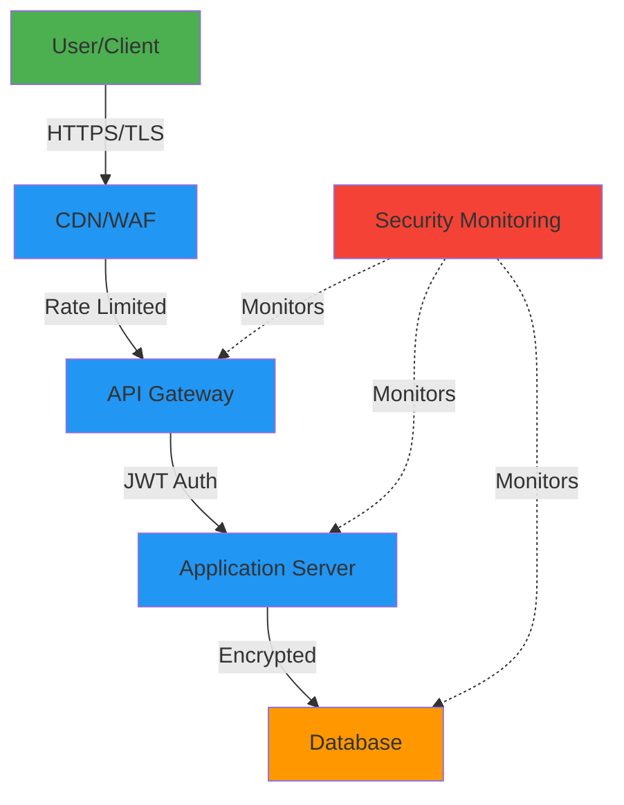

# Security Approach: Krawl

> **Purpose:** This document explains Krawl's security philosophy, principles, and strategic approach to protecting user data and maintaining system integrity.

**Version:** 2.0.0  
**Last Updated:** 2025-10-31  
**Status:** Active  
**Owner:** Security Team

---

## Overview

Krawl's security approach is built on **defense in depth**, **privacy by design**, and **community trust**. We protect user data at every layer while maintaining a seamless user experience.

---

## Security Principles

### 1. Defense in Depth

We implement security at multiple layers:

```
┌─────────────────────────────────┐
│  User Layer (Browser)           │  ← Input validation, HTTPS
├─────────────────────────────────┤
│  Application Layer (API)        │  ← Authentication, authorization
├─────────────────────────────────┤
│  Business Logic Layer           │  ← Rate limiting, validation
├─────────────────────────────────┤
│  Data Layer (Database)          │  ← Encryption, access control
├─────────────────────────────────┤
│  Infrastructure Layer           │  ← Firewalls, monitoring
└─────────────────────────────────┘
```

**Why:** Single security measure failures won't compromise the entire system.

---

### 2. Privacy by Design

We minimize data collection and protect user privacy from the start:

- **Data Minimization**: Collect only essential information
- **Purpose Limitation**: Use data only for stated purposes
- **Storage Limitation**: Delete data when no longer needed
- **User Control**: Users can access, modify, and delete their data
- **Transparency**: Clear privacy policies and practices

**Why:** Privacy builds trust and protects users from data misuse.

---

### 3. Zero Trust Architecture

We never assume trust based on network location:

- All API requests must be authenticated
- All database queries use parameterized statements
- All user input is validated and sanitized
- All data transmission is encrypted
- All access is logged and monitored

**Why:** Insider threats and compromised credentials are real risks.

---

## Security by Design

### Authentication Strategy

**Token-Based Authentication (JWT)**

We chose JWT over session-based authentication because:

✅ **Stateless**: No server-side session storage needed  
✅ **Scalable**: Works across multiple servers  
✅ **Mobile-Friendly**: Perfect for PWA architecture  
✅ **Standard**: Industry-proven approach

**Trade-offs:**
- Token revocation requires blacklist (complexity)
- Larger payload than session IDs (minimal impact)

---

### Authorization Model

**Role-Based Access Control (RBAC)**

We use RBAC because:

✅ **Simple to understand**: Clear user roles and permissions  
✅ **Easy to maintain**: Centralized permission management  
✅ **Scalable**: New roles can be added easily  
✅ **Secure by default**: Explicit permission grants

**Roles:**
- Anonymous: View public content
- User: Create and manage own content
- Moderator: Review reports and moderate content
- Admin: Full system access

---

### Data Protection Strategy

**Encryption Approach:**

| Data Type | At Rest | In Transit | Why |
|-----------|---------|------------|-----|
| Passwords | BCrypt hash | HTTPS | One-way hash prevents password recovery |
| User data | Database encryption | HTTPS | Protects against database compromise |
| API tokens | Signed (JWT) | HTTPS | Tamper-proof, verifiable |
| Files | Cloud encryption | HTTPS | Leverages cloud provider security |

**Why BCrypt over other hashing algorithms:**
- Adaptive cost factor (scales with hardware)
- Built-in salt (prevents rainbow tables)
- Slow by design (resists brute force)
- Industry standard for password hashing

---

## Threat Model

### Identified Threats

**1. Unauthorized Access**
- **Risk**: Account takeover, data breach
- **Mitigation**: Strong passwords, JWT with expiration, MFA (future)
- **Priority**: 🔴 Critical

**2. Injection Attacks (SQL, XSS)**
- **Risk**: Data theft, malicious code execution
- **Mitigation**: Parameterized queries, input sanitization, output encoding
- **Priority**: 🔴 Critical

**3. Denial of Service (DoS/DDoS)**
- **Risk**: Service unavailability
- **Mitigation**: Rate limiting, CDN protection, auto-scaling
- **Priority**: 🟡 High

**4. Data Leakage**
- **Risk**: Sensitive information exposure
- **Mitigation**: Access controls, encryption, audit logging
- **Priority**: 🔴 Critical

**5. Insider Threats**
- **Risk**: Malicious employee actions
- **Mitigation**: Least privilege, audit trails, separation of duties
- **Priority**: 🟡 Medium

---

## Security Architecture

### Layered Security Model



**Layer 1: Transport (TLS/HTTPS)**
- Encrypts all data in transit
- Prevents man-in-the-middle attacks
- Certificate-based trust

**Layer 2: Application (Authentication & Authorization)**
- Verifies user identity
- Controls access to resources
- Enforces business rules

**Layer 3: Data (Encryption & Access Control)**
- Encrypts sensitive data
- Limits database access
- Audit trails for all operations

**Layer 4: Infrastructure (Monitoring & Response)**
- Detects anomalies
- Alerts on threats
- Enables rapid response

---

## Privacy Approach

### Data Classification

We classify data by sensitivity to apply appropriate protection:

**🔴 Critical (Encrypted at rest)**
- Passwords (hashed, not encrypted)
- Payment information (future feature)
- API keys and secrets

**🟡 Sensitive (Access controlled)**
- Email addresses
- User profiles
- Private Krawls
- IP addresses (temporary)

**🟢 Public (No restrictions)**
- Public Gems
- Public Krawls
- Ratings and vouches
- Usernames

**Why this matters:** Different data requires different protection levels. Over-securing public data wastes resources; under-securing sensitive data creates risk.

---

### User Rights

We respect user privacy rights:

| Right | Implementation | Why Important |
|-------|----------------|---------------|
| **Access** | Data export API | Transparency and trust |
| **Rectification** | Edit profile/content | User control over data |
| **Erasure** | Account deletion | Privacy compliance |
| **Portability** | JSON export | User data ownership |
| **Object** | Analytics opt-out | User consent |

---

## Compliance Strategy

### Philippine Data Privacy Act Alignment

We align with local Philippine regulations:

- **Consent**: Users consent to data collection
- **Purpose**: Clear data usage purposes
- **Proportionality**: Minimal data collection
- **Transparency**: Public privacy policy
- **Security**: Appropriate safeguards
- **Accountability**: Designated data officer

**Note:** While we're not required to comply with GDPR (not EU-based), we follow GDPR principles as best practices.

---

## Incident Response Philosophy

### Proactive vs. Reactive

We balance proactive measures with reactive capabilities:

**Proactive (70% of effort):**
- Secure coding practices
- Regular security testing
- Continuous monitoring
- Staff training

**Reactive (30% of effort):**
- Incident response procedures
- Backup and recovery
- Forensic capabilities
- Communication plans

**Why this balance:** Prevention is better than cure, but incidents will happen. We prepare for both.

---

## Security Trade-offs

### Usability vs. Security

We make conscious trade-offs:

| Feature | Security Option | Usability Impact | Our Choice |
|---------|----------------|------------------|------------|
| Login | MFA required | Higher friction | MFA optional (for MVP) |
| Passwords | 16+ chars | User frustration | 8+ chars with complexity |
| Sessions | 1-hour timeout | Frequent re-login | 24-hour timeout |
| Rate limits | Strict limits | Impacts power users | Balanced limits |

**Philosophy:** Security shouldn't make the app unusable, but usability shouldn't compromise core security.

---

## Future Security Enhancements

### Planned Improvements

**Phase 2 (Post-MVP):**
- Multi-factor authentication (MFA)
- OAuth2 social login
- Enhanced anomaly detection
- Security information and event management (SIEM)

**Phase 3 (Scale):**
- Bug bounty program
- Third-party security audits
- Advanced threat protection
- Dedicated security operations center (SOC)

---

## Security Culture

### Team Responsibilities

**Everyone is responsible for security:**

- **Developers**: Write secure code, follow best practices
- **DevOps**: Secure infrastructure, monitor threats
- **Product**: Balance security with UX
- **Support**: Identify and escalate security issues

**Security is not just the security team's job.**

---

## 📚 Related Documents

- [Security Requirements](../reference/security-requirements.md) - Standards and specifications
- [Implement Security](../how-to/implement-security.md) - Implementation procedures
- [System Architecture](./architecture-overview.md) - Overall system design
- [API Documentation](../reference/api-endpoints.md) - API security details

---

## 📝 Changelog

| Version | Date | Changes | Author |
|---------|------|---------|--------|
| 2.0.0 | 2025-10-31 | Split from security-plan.md, focused on concepts and strategy | Security Team |
| 1.0.0 | 2025-10-28 | Original security plan | Security Team |

---

*Document maintained by Security Team • Last reviewed: 2025-10-31*

