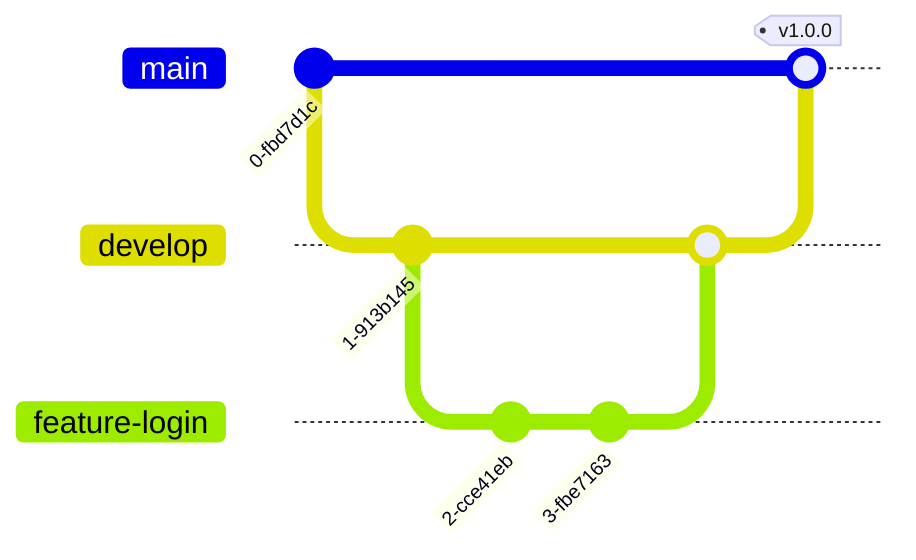

# 🚀 Hosting and Deployment Plan: Krawl MVP

> **Purpose:** This document outlines the comprehensive deployment strategy for the Krawl Progressive Web App (PWA) and backend infrastructure, including hosting providers, CI/CD workflow, SSL configuration, and monitoring setup.

**Version:** 0.1.0-MVP  
**Last Updated:** 2025-10-31  
**Status:** Active  
**Owner:** DevOps Team

---

## 📋 Table of Contents

- [Domain Name](#-domain-name)
- [Hosting Providers](#️-hosting-providers)
- [SSL Certificate](#-ssl-certificate)
- [CI/CD Workflow](#-cicd-workflow)

---

## 🌐 Domain Name

### Proposed Options

| Priority | Domain | Status | Notes |
|----------|--------|--------|-------|
| **1st** | `krawl.ph` | TBD | Primary choice - emphasizes local focus |
| **2nd** | `krawlapp.ph` | TBD | Alternative if primary taken |
| **3rd** | `krawl.app` | TBD | Modern app-focused extension |
| **4th** | `gokrawl.app` | TBD | Action-oriented variant |

### ✅ Selection Criteria

- **Short & Memorable** - Easy to type and remember
- **Brandable** - Aligns with Krawl identity
- **Local Focus** - `.ph` emphasizes Philippine market
- **Flexibility** - Multiple alternatives ensure availability

### 🏪 Registrar Options

- GoDaddy
- Namecheap
- Google Domains
- Local Philippine registrar

> **Decision**: To be finalized based on availability and pricing

---

## 🏗️ Hosting Providers

> **MVP Strategy**: Leveraging free/low-cost tiers for cost efficiency

### 1. Frontend (Next.js PWA)

#### 🎯 Recommended Provider: **Vercel**

| Provider | Tier | Cost | Features |
|----------|------|------|----------|
| **Vercel** ⭐ | Free/Hobby → Pro | $0 → $20/mo | Native Next.js support, Global CDN, Auto SSL, Git integration |
| Netlify | Free → Pro | $0 → $19/mo | Excellent Next.js support, Global CDN, Auto SSL |

**Why Vercel?**
- Built by the creators of Next.js
- Seamless Next.js integration
- Automatic deployments from Git
- Global Content Delivery Network (CDN)
- Free automatic SSL certificates
- Generous free tier for MVPs

**Deployment Path**:
```
Start: Free/Hobby Tier
Upgrade Trigger: Higher bandwidth/build limits needed
Upgrade Cost: ~$20/mo (Pro tier)
```

---

### 2. Backend (Spring Boot API)

#### 🎯 Recommended Provider: **Render**

| Provider | Tier | Cost | Key Benefits |
|----------|------|------|--------------|
| **Render** ⭐ | Free → Starter | $0 → $7-15/mo | Docker support, Easy PostgreSQL integration, Auto-deploy |
| Heroku | Eco Dynos | $5-7/mo | Simple deployment, Mature platform |
| AWS Elastic Beanstalk | Free Tier → Paid | Variable | High control, AWS ecosystem |
| Google Cloud Run | Free Tier → Paid | Pay-per-use | Serverless, Auto-scaling |

**Why Render?**
- Simple deployment model for Dockerized Spring Boot apps
- Native build support (no Docker required)
- Free tier available for MVP testing
- Seamless PostgreSQL integration
- Easy scaling path
- Zero-downtime deployments

**Deployment Path**:
```
Start: Free Web Service Tier
  ⚠️  Limitation: Service spins down with inactivity
  
Upgrade Trigger: Need persistent service + more resources
Upgrade Cost: ~$7-15/mo (Starter plan)
```

---

### 3. Database (PostgreSQL + PostGIS)

#### 🎯 Recommended Provider: **Render PostgreSQL** or **Supabase**

| Provider | Tier | Cost | PostGIS | Notes |
|----------|------|------|---------|-------|
| **Render PostgreSQL** ⭐ | Free → Starter | $0 → $7/mo | ✅ | Easy backend integration |
| **Supabase** ⭐ | Free → Pro | $0 → $25/mo | ✅ | Generous free tier, additional features |
| Neon | Free → Pro | $0 → $19/mo | ✅ | Serverless PostgreSQL |
| AWS RDS | Free Tier → Paid | Limited free | ✅ | 12-month free tier |
| Google Cloud SQL | Free Tier → Paid | Limited free | ✅ | Complex pricing |

**Why Render PostgreSQL?**
- Seamless connection to Render-hosted backend
- Managed service (no maintenance overhead)
- Includes PostGIS for geospatial queries
- Simple pricing model

**Why Supabase?**
- Extremely generous free tier (500MB database, 2GB bandwidth)
- Built-in PostGIS support
- Additional features (Auth, Storage, Realtime)
- Great for MVP phase

**Deployment Path**:
```
Start: Render Free DB Tier OR Supabase Free Tier
  
Upgrade Trigger: Storage/connection limits reached
Upgrade Cost: $7-25/mo (varies by provider)
```

---

### 4. Image Storage

#### 🎯 Recommended Provider: **Cloudinary**

| Provider | Tier | Cost | Key Features |
|----------|------|------|--------------|
| **Cloudinary** ⭐ | Free → Plus | $0 → $99/mo | 25GB storage, transformations, CDN, AI features |
| AWS S3 | Free Tier → Paid | Variable | Scalable, requires CDN setup |
| Google Cloud Storage | Free Tier → Paid | Variable | Scalable, GCP integration |

**Why Cloudinary?**
- Generous free tier (25GB storage, 25GB bandwidth/month)
- Built for image/video management
- Automatic image transformations and optimization
- Integrated CDN for fast delivery
- Simple API integration
- No complex CDN setup required

**Free Tier Capacity**:
```
Storage: 25 GB
Bandwidth: 25 GB/month
Transformations: 25 credits/month
Estimated Support: ~10,000+ optimized images
```

**Deployment Path**:
```
Start: Cloudinary Free Tier
Upgrade Trigger: Storage/bandwidth limits reached
Upgrade Cost: $99/mo (Plus tier - 112GB storage, 120GB bandwidth)
```

---

## 🔒 SSL Certificate

> **Requirement**: All traffic MUST be served over HTTPS

| Component | SSL Provider | Cost | Implementation |
|-----------|--------------|------|----------------|
| **Frontend** | Vercel/Netlify | FREE | ✅ Automatic |
| **Backend** | Render/Heroku | FREE | ✅ Automatic |
| **Custom Domain** | Let's Encrypt | FREE | ✅ Managed by hosting platform |

### 📌 Key Points

- ✅ **Zero configuration** - Platforms handle SSL automatically
- ✅ **Auto-renewal** - No manual certificate management
- ✅ **Custom domains** - Free SSL for custom domain mapping
- ✅ **Let's Encrypt** - Industry-standard certificates

---

## 🔄 CI/CD Workflow

> **Continuous Integration / Continuous Deployment Strategy**

### 📦 Source Code Repository

**Platform**: GitHub (primary recommendation)

**Alternatives**: GitLab, Bitbucket

### 🌿 Branching Strategy



**Strategy**: Gitflow (or simplified GitHub Flow)

| Branch | Purpose | Deploy Target |
|--------|---------|---------------|
| `main` | Production-ready code | 🟢 Production |
| `develop` | Integration branch | 🟡 Staging (optional) |
| `feature/*` | New features | 🔵 Development/Local |
| `hotfix/*` | Emergency fixes | 🔴 Fast-track to main |

---

### 🎨 Frontend CI/CD Pipeline

**Platform**: Vercel/Netlify G
egration

#### Workflow

```yaml
Trigger: Push/Merge to 'main' branch
    ↓
Vercel/Netlify Auto-Detects Changes
    ↓
Build Next.js Application
    ├─ Run: next build
    ├─ Generate: Static assets
    └─ Compile: Serverless functions
    ↓
Run Automated Tests
    ├─ Unit Tests (Jest/Vitest)
    ├─ Integration Tests
    └─ E2E Tests (optional for MVP)
    ↓
Tests Pass? ──NO──→ ❌ Deployment Failed (Rollback)
    ↓ YES
    ↓
Deploy to Production
    ├─ Deploy static assets to CDN
    ├─ Deploy serverless functions
    └─ Invalidate cache
    ↓
Update Live Domain
    └─ ✅ krawl.ph live
```

#### Configuration Example

```javascript
// vercel.json
{
  "buildCommand": "npm run build",
  "outputDirectory": ".next",
  "devCommand": "npm run dev",
  "installCommand": "npm install",
  "framework": "nextjs",
  "regions": ["sin1"], // Singapore region for PH users
  "env": {
    "NEXT_PUBLIC_API_URL": "@api-url"
  }
}
```

---

### ⚙️ Backend CI/CD Pipeline

**Platform**: Render GitHub Integration (or GitHub Actions)

#### Workflow

```yaml
Trigger: Push/Merge to 'main' branch
    ↓
Render Auto-Detects Changes
    ↓
Build Spring Boot Application
    ├─ Option A: Docker build (if Dockerfile present)
    ├─ Option B: Native buildpack (Maven/Gradle)
    └─ Install dependencies
    ↓
Run Automated Tests
    ├─ Unit Tests (JUnit)
    ├─ Integration Tests
    └─ API Contract Tests
    ↓
Tests Pass? ──NO──→ ❌ Build Failed (Rollback)
    ↓ YES
    ↓
Create New Deployment
    ├─ Build container/artifact
    ├─ Run database migrations (Flyway/Liquibase)
    └─ Health checks
    ↓
Deploy with Zero-Downtime
    ├─ Spin up new instance
    ├─ Wait for health check pass
    ├─ Route traffic to new instance
    └─ Spin down old instance
    ↓
✅ Backend Live
```

#### Dockerfile Example

```dockerfile
# Dockerfile for Spring Boot Backend
FROM eclipse-temurin:17-jdk-alpine AS build
WORKDIR /app
COPY mvnw .
COPY .mvn .mvn
COPY pom.xml .
COPY src src
RUN ./mvnw clean package -DskipTests

FROM eclipse-temurin:17-jre-alpine
WORKDIR /app
COPY --from=build /app/target/*.jar app.jar
EXPOSE 8080
ENTRYPOINT ["java", "-jar", "app.jar"]
```

---

### 🗄️ Database Migration Strategy

**Approach**: Controlled, version-controlled schema changes

| Tool | Language | Integration |
|------|----------|-------------|
| **Flyway** ⭐ | SQL | Maven/Gradle plugin |
| Liquibase | XML/SQL | Maven/Gradle plugin |

#### Migration Workflow

```yaml
Backend Deployment Triggered
    ↓
Pre-Deployment Hook
    ↓
Run Flyway Migration
    ├─ Check migration history
    ├─ Apply pending migrations
    └─ Validate checksums
    ↓
Migration Success? ──NO──→ ❌ Stop Deployment
    ↓ YES
    ↓
Continue Backend Deployment
    └─ ✅ Schema up-to-date
```

**⚠️ Important**: Direct pushes to `main` should NOT automatically alter production schema without manual review for high-risk changes.

---

## 📊 MVP Phase Summary

### Initial Setup (Free Tier)

| Component | Provider | Monthly Cost |
|-----------|----------|--------------|
| Domain | Registrar | ~₱500-800/year (~₱42-67/mo) |
| Frontend | Vercel Free | $0 |
| Backend | Render Free | $0 |
| Database | Supabase/Render Free | $0 |
| Image Storage | Cloudinary Free | $0 |
| SSL | Automated | $0 |
| **Total** | | **~₱42-67/month** |

### Post-MVP Scaling (Paid Tier)

| Component | Provider | Monthly Cost |
|-----------|----------|--------------|
| Domain | Registrar | ~₱42-67/mo |
| Frontend | Vercel Pro | $20 |
| Backend | Render Starter | $7-15 |
| Database | Render/Supabase | $7-25 |
| Image Storage | Cloudinary Plus | $99 (if needed) |
| **Total (Basic)** | | **~$34-67 (~₱1,900-3,700)** |
| **Total (Full)** | | **~$133-165 (~₱7,400-9,200)** |

---

## 🎯 Key Benefits of This Approach

### ✅ Automation First
- Zero-touch deployments from Git
- Automatic testing before production
- Instant rollback capabilities

### ✅ Cost Efficient
- Start with generous free tiers
- Pay-as-you-grow model
- No upfront infrastructure costs

### ✅ Developer Experience
- Simple configuration
- Platform-managed SSL, CDN, scaling
- Focus on code, not infrastructure

### ✅ Production Ready
- Global CDN for fast delivery
- Zero-downtime deployments
- Automatic SSL/HTTPS
- Built-in monitoring and logs

### ✅ Scalable
- Easy upgrade paths
- Horizontal scaling available
- No architecture rewrites needed

---

## 📅 Deployment Timeline

```
Week 1: Setup & Configuration
├─ Register domain
├─ Create platform accounts (Vercel, Render, Cloudinary)
└─ Configure GitHub repository

Week 2: Frontend Deployment
├─ Connect Vercel to GitHub
├─ Configure environment variables
├─ Deploy staging environment
└─ Test and deploy production

Week 3: Backend Deployment
├─ Connect Render to GitHub
├─ Setup PostgreSQL database
├─ Configure database migrations
├─ Deploy staging environment
└─ Test and deploy production

Week 4: Integration & Testing
├─ Connect frontend to backend
├─ Setup Cloudinary integration
├─ End-to-end testing
├─ Performance optimization
└─ Go live! 🚀
```

---

## 🔍 Monitoring & Maintenance

### Essential Tools

- **Vercel Analytics** - Frontend performance monitoring
- **Render Metrics** - Backend health and performance
- **PostgreSQL Insights** - Database query performance
- **Cloudinary Reports** - Image delivery metrics
- **Sentry** (optional) - Error tracking and monitoring

### Regular Checks

- [ ] Weekly: Review deployment logs
- [ ] Weekly: Check resource usage vs. limits
- [ ] Monthly: Review costs and optimize
- [ ] Monthly: Security updates and dependency patches

---

## 📚 Additional Resources

- [Vercel Documentation](https://vercel.com/docs)
- [Render Documentation](https://render.com/docs)
- [Next.js Deployment Guide](https://nextjs.org/docs/deployment)
- [Spring Boot on Render](https://render.com/docs/deploy-spring-boot)
- [Cloudinary Documentation](https://cloudinary.com/documentation)

---

## 📝 Changelog

| Version | Date | Changes | Author |
|---------|------|---------|--------|
| 1.0.0 | 2025-10-28 | Initial hosting and deployment plan | DevOps Team |

---

## 📚 Related Documents

- [Tech Stack](./tech-stack.md) - Technology choices affecting deployment
- [System Architecture](./system-architecture.md) - System design and infrastructure
- [Project Setup](./project-setup.md) - Development environment setup
- [Version Control Strategy](./version-control-strategy.md) - Git workflow and CI/CD
- [Security Plan](./security-plan.md) - Security considerations for deployment

---

*Document maintained by DevOps Team • Last reviewed: 2025-10-28*

