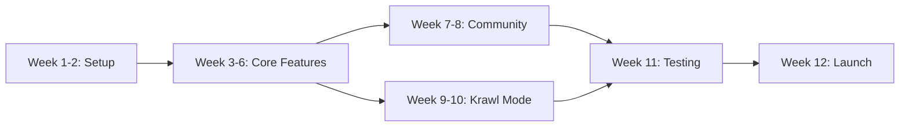

# 📅 Milestone Plan & Timeline: Krawl MVP

> **Purpose:** This document outlines the 12-week development timeline for the Krawl MVP, breaking down deliverables, milestones, and success criteria for each phase.

**Version:** 0.1.0-MVP  
**Last Updated:** 2025-11-01  
**Status:** Active  
**Owner:** Project Lead

---

## 📍 Week 1-2: Project Setup & Foundation

### 🎯 Milestone
**Initial project structure, basic design system, core architecture defined.**

### ✅ Deliverables
- 📦 Repository setup
- ⚙️ Tech stack configuration (Next.js, Spring Boot, PostgreSQL/PostGIS)
- 🎨 Initial "Lokal Verde" design tokens
- 🔄 Basic CI/CD pipeline

---

## 📍 Week 3-6: Core Feature Development

### 🎯 Milestone
**Users can register, log in, pin Gems (with duplicate check), create basic Krawls, and view Gem/Krawl details. Basic map display functional.**

### ✅ Deliverables

| Feature | Frontend | Backend |
|---------|----------|---------|
| **🔐 Authentication** | Login/Register UI | JWT auth system |
| **📍 Gem Pinning** | Pin workflow + duplicate check | Gem creation API |
| **🚶 Krawl Creation** | Trail builder interface | Krawl management API |
| **🗺️ Map Display** | Interactive map with clustering | Geo-query endpoints |
| **👁️ Detail Views** | Gem/Krawl detail pages | Data retrieval APIs |

---

## 📍 Week 7-8: Community & Quality Features

### 🎯 Milestone
**Vouching, rating, and basic reporting systems are functional. User profiles display reputation tier.**

### ✅ Deliverables
```
Community Features
├── ✅ Vouch System
│   ├── Vouch/Rate buttons & UI
│   └── API logic for verification
│
├── 🚩 Reporting System
│   ├── Flag functionality
│   └── Status updates (Verified, Flagged)
│
└── 👤 User Reputation
    ├── Creator Score calculation
    └── Profile page enhancements
```

---

## 📍 Week 9-10: Krawl Mode & Offline Implementation

### 🎯 Milestone
**Users can download Krawls and follow them in Krawl Mode, including basic offline navigation and viewing cached notes.**

### ✅ Deliverables

| Component | Implementation |
|-----------|----------------|
| **📥 Download System** | Caching data/tiles logic |
| **🧭 Krawl Mode UI** | Step-by-step navigation interface |
| **📍 GPS Integration** | Proximity triggers for waypoints |
| **📴 Offline Support** | Offline map rendering & data access |

### 💡 Key Feature: Krawl Mode
> Transform discovery into an immersive, guided adventure with real-time, location-aware guidance

---

## 📍 Week 11: Testing, Bug Fixing & Deployment

### 🎯 Milestone
**MVP features are thoroughly tested, critical bugs are resolved, and the PWA is deployed to a staging/production environment.**

### ✅ Deliverables
```
Testing & Deployment Checklist
│
├── 🧪 End-to-end testing
├── 📱 Cross-browser/device checks
├── ⚡ Performance tweaks
└── 🚀 Deployment configuration
    ├── Staging environment
    └── Production environment
```

---

## 📍 Week 12: Content Seeding & Launch Readiness

### 🎯 Milestone
**Initial launch area (e.g., Cebu district) is sufficiently populated with Gems/Krawls. Founding users onboarded. Pilot businesses contacted. App is ready for initial user access.**

### ✅ Deliverables

#### 🌱 Content Goals
- **100+ Gems** seeded in launch area
- **10+ Krawls** created with quality trails
- **Founding Users** recruited and onboarded
- **5-10 Pilot Businesses** contacted for "Claim Your Gem"

#### 📚 Documentation
- User onboarding guides
- Business pilot documentation
- Community guidelines

#### ✨ Final Checks
- Pre-launch quality assurance
- Marketing materials ready
- Support channels established

---

## 📊 Progress Tracking
```
┌─────────────────────────────────────────────────────────────┐
│  Week 1-2   │████████░░░░░░░░░░░░░░░░░░░░░░░░░░  Foundation │
│  Week 3-6   │░░░░░░░░████████████████░░░░░░░░░░  Core Build │
│  Week 7-8   │░░░░░░░░░░░░░░░░░░░░░░░░████████░░  Community │
│  Week 9-10  │░░░░░░░░░░░░░░░░░░░░░░░░░░░░░░░░██  Krawl Mode│
│  Week 11    │░░░░░░░░░░░░░░░░░░░░░░░░░░░░░░░░░█  Testing   │
│  Week 12    │░░░░░░░░░░░░░░░░░░░░░░░░░░░░░░░░░█  Launch    │
└─────────────────────────────────────────────────────────────┘
```

---

## 🎯 Critical Path Dependencies


---

<div align="center">

## 🚀 Launch Readiness Criteria

| Criteria | Target | Status |
|----------|--------|--------|
| **✅ Core Features** | All functional | Week 6 |
| **👥 Community Tools** | Implemented | Week 8 |
| **🧭 Krawl Mode** | Offline-ready | Week 10 |
| **🧪 Testing Complete** | All critical bugs fixed | Week 11 |
| **🌱 Content Seeded** | 100+ Gems, 10+ Krawls | Week 12 |
| **🎉 GO LIVE** | Public access enabled | Week 12 |

---

### 💡 Key Success Factors

**🏗️ Solid Foundation** • **⚡ Agile Execution** • **👥 Community Focus** • **📴 Offline-First**

---

*From setup to launch in 12 weeks — Building the living map of Filipino culture*

</div>

---

## 📝 Changelog

| Version | Date | Changes | Author |
|---------|------|---------|--------|
| 1.0.0 | 2025-10-28 | Initial milestone and timeline document | Project Lead |

---

## 📚 Related Documents

- [Project Brief](./project-brief.md) - Project overview and business case
- [Scope of Work](./scope-of-work.md) - Feature scope and deliverables
- [Kanban Task](./kanban-task.md) - Detailed task breakdown

---

*Document maintained by Project Lead • Last reviewed: 2025-10-28*