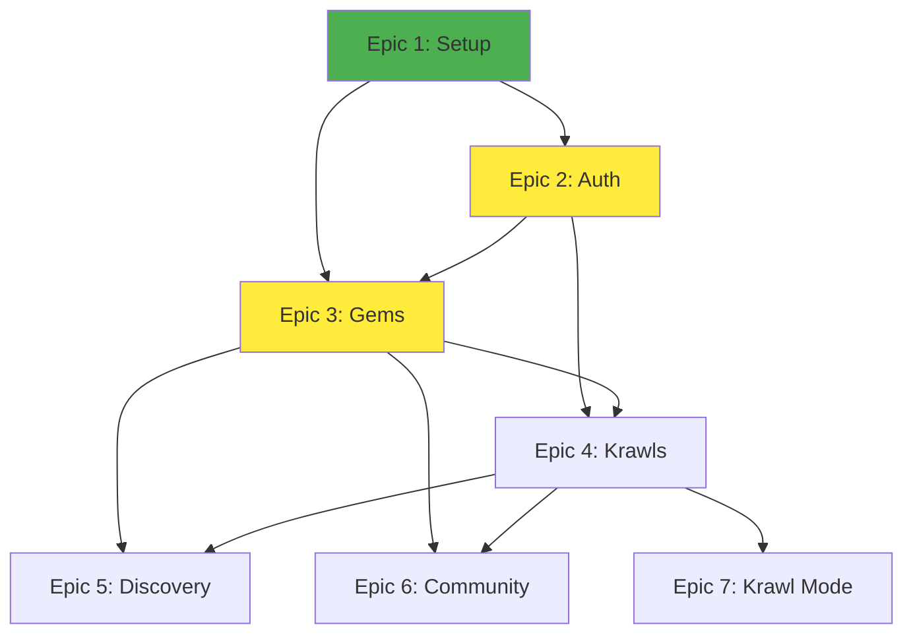

# Krawl MVP - Task Board

> **Purpose:** This folder contains task breakdowns organized by epic for the Krawl MVP development.

**Last Updated:** 2025-10-31  
**Status:** Active

---

## Overview

Tasks are organized by **7 development epics**, making it easier to track progress and coordinate team efforts. Each epic file contains detailed tasks with acceptance criteria and status tracking.

---

## Epic Structure

Each epic file follows this format:
- Epic description and goals
- Task breakdown with IDs
- Acceptance criteria
- Status tracking (To Do, In Progress, Done)
- Dependencies and notes

### Task Instruction Blocks

Every task now includes a standardized "How to Implement" block containing:
- Context: why the task exists
- Prerequisites: env, migrations, credentials, branches
- Steps: numbered, concrete actions (5–10 max)
- References: links to Tutorials, How-to, Explanation, Reference
- Acceptance Criteria: verifiable outcomes
- Test/Verification: commands, endpoints, or UX checks
- Artifacts: PR title, screenshots, schema updates if relevant

Use these instruction blocks as the single source of truth when executing tasks.

---

## Epics

### 📦 [Epic 1: Project Setup](./epic-1-project-setup.md)
**Focus:** Initialize project structure, configure development environment, set up CI/CD

**Key Tasks:**
- Git repository setup
- Naming conventions
- Docker configuration
- Backend and frontend initialization

**Status:** 🟢 Complete

---

### 🔐 [Epic 2: Authentication & Profile](./epic-2-auth-profile.md)
**Focus:** User authentication, authorization, and profile management

**Key Tasks:**
- User registration and login
- JWT implementation
- Profile viewing and editing
- Session management

**Status:** 🟡 In Progress

---

### 💎 [Epic 3: Gem Creation & Display](./epic-3-gem-creation.md)
**Focus:** Pin and display Gems on the map

**Key Tasks:**
- Gem pinning workflow
- Duplicate detection
- Map display with clustering
- Gem detail view

**Status:** 🟡 In Progress

---

### 🚶 [Epic 4: Krawl Creation & Display](./epic-4-krawl-creation.md)
**Focus:** Create and manage curated trails

**Key Tasks:**
- Krawl creation interface
- Trail builder with drag-and-drop
- Krawl detail page
- Notes and secrets

**Status:** ⚪ To Do

---

### 🔍 [Epic 5: Discovery & Exploration](./epic-5-discovery.md)
**Focus:** Search, filter, and discover content

**Key Tasks:**
- Search functionality
- Filter system
- Discover page
- Recommendation engine

**Status:** ⚪ To Do

---

### 👥 [Epic 6: Community Interaction](./epic-6-community.md)
**Focus:** Vouching, rating, reporting, and reputation

**Key Tasks:**
- Vouch system
- Rating and reviews
- Report functionality
- Reputation calculation

**Status:** ⚪ To Do

---

### 🧭 [Epic 7: Krawl Mode & Offline](./epic-7-krawl-mode-offline.md)
**Focus:** Guided navigation and offline functionality

**Key Tasks:**
- Krawl Mode interface
- GPS integration
- Offline caching
- Sync mechanism

**Status:** ⚪ To Do

---

## Status Legend

| Icon | Status | Description |
|------|--------|-------------|
| 🟢 | Complete | All tasks done, tested, and deployed |
| 🟡 | In Progress | Active development |
| ⚪ | To Do | Planned but not started |
| 🔴 | Blocked | Waiting on dependencies |

---

## Task Status Columns

Each epic uses a Kanban board structure:

```
┌─────────────┬──────────────┬──────────┐
│   To Do     │ In Progress  │   Done   │
└─────────────┴──────────────┴──────────┘
```

- **To Do:** Task defined, ready to start
- **In Progress:** Currently being worked on
- **Done:** Completed and verified

---

## How to Use This Structure

### For Developers

1. Pick an epic based on current sprint focus
2. Choose a task from "To Do" column
3. Move it to "In Progress"
4. Complete the task and verify acceptance criteria
5. Move to "Done" and update the epic file

### For Project Managers

1. Review epic progress weekly
2. Update status icons in this README
3. Identify blockers and dependencies
4. Coordinate epic priorities with team

### For Updates

When updating task status:

```bash
# Edit the specific epic file
docs/planning/tasks/epic-X-name.md

# Update task status
- Move task between columns (To Do → In Progress → Done)
- Update acceptance criteria checklist
- Add notes or blockers

# Commit with descriptive message
git commit -m "tasks: update Epic 3 - completed Gem detail view"
```

---

## Dependencies Between Epics



**Critical Path:** Epic 1 → Epic 2 → Epic 3 → Epic 4 → Epic 7

---

## Progress Tracking

### Overall MVP Progress

```
Epic 1: ████████████████████ 100% (Setup)
Epic 2: ██████████░░░░░░░░░░  50% (Auth)
Epic 3: ████████░░░░░░░░░░░░  40% (Gems)
Epic 4: ░░░░░░░░░░░░░░░░░░░░   0% (Krawls)
Epic 5: ░░░░░░░░░░░░░░░░░░░░   0% (Discovery)
Epic 6: ░░░░░░░░░░░░░░░░░░░░   0% (Community)
Epic 7: ░░░░░░░░░░░░░░░░░░░░   0% (Krawl Mode)
───────────────────────────────────
Overall: ████░░░░░░░░░░░░░░░░  27%
```

*Last updated: 2025-10-31*

---

## Sprint Planning

### Current Sprint Focus
- Complete Epic 2 (Authentication)
- Continue Epic 3 (Gem Creation)

### Next Sprint
- Begin Epic 4 (Krawl Creation)
- Complete Epic 3 (Gem Display)

### Future Sprints
- Epic 5 & 6 (Discovery & Community)
- Epic 7 (Krawl Mode - Critical for MVP)

---

## Notes

- **Recommended Tools:** Use GitHub Projects, Trello, or Notion to track real-time progress
- **Meeting Cadence:** Review epic progress in weekly team meetings
- **Flexibility:** Task priorities may shift based on user feedback and blockers

---

## 📚 Related Documents

- [Milestone and Timeline](../milestone-and-timeline.md) - 12-week development plan
- [User Stories](../user-story.md) - Feature requirements
- [Scope of Work](../scope-of-work.md) - MVP feature scope
- [Project Brief](../project-brief.md) - Project overview

---

*Task tracking maintained by Project Team • Updated daily*

