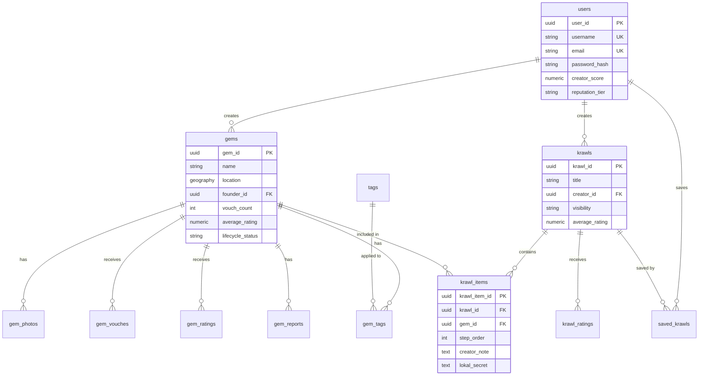

# Database Schema: Krawl

> **Purpose:** This document defines the PostgreSQL database schema for Krawl, including all tables, relationships, and indexes using PostGIS.

**Version:** 2.0.0  
**Last Updated:** 2025-10-31  
**Status:** Active  
**Owner:** Backend Team  
**Tech Stack:** PostgreSQL 14+, PostGIS 3.0+

---

## Quick Reference

| Table | Purpose | Key Relationships |
|-------|---------|-------------------|
| `users` | User accounts | → gems, krawls |
| `gems` | Points of interest | ← users, → tags, photos, ratings |
| `krawls` | Curated trails | ← users, → krawl_items, ratings |
| `krawl_items` | Krawl stops (ordered) | ← krawls, gems |

**Total Tables:** 12  
**Geospatial Type:** PostGIS `GEOGRAPHY(Point, 4326)`

---

## Prerequisites

```sql
CREATE EXTENSION IF NOT EXISTS postgis;
```

---

## 1. `users` Table

Stores registered user accounts and reputation data.

```sql
CREATE TABLE users (
    user_id UUID PRIMARY KEY DEFAULT gen_random_uuid(),
    username VARCHAR(50) UNIQUE NOT NULL,
    email VARCHAR(255) UNIQUE NOT NULL,
    password_hash VARCHAR(255) NOT NULL,
    bio TEXT,
    creator_score NUMERIC(3, 2) DEFAULT 0.00,
    reputation_tier VARCHAR(50) DEFAULT 'Newcomer',
    created_at TIMESTAMPTZ DEFAULT CURRENT_TIMESTAMP,
    updated_at TIMESTAMPTZ DEFAULT CURRENT_TIMESTAMP,
    deleted_at TIMESTAMPTZ
);

CREATE INDEX idx_users_email ON users(email);
CREATE INDEX idx_users_deleted_at ON users(deleted_at);
```

**Key Fields:**
- `user_id` - UUID primary key
- `creator_score` - Average rating of created Krawls (0.00-5.00)
- `reputation_tier` - User level: Newcomer, Trail Maker, Kanto Guide
- `deleted_at` - Soft delete support

---

## 2. `gems` Table

Stores points of interest with geospatial data.

```sql
CREATE TABLE gems (
    gem_id UUID PRIMARY KEY DEFAULT gen_random_uuid(),
    name VARCHAR(255) NOT NULL,
    description TEXT,
    location GEOGRAPHY(Point, 4326) NOT NULL,
    founder_id UUID REFERENCES users(user_id) ON DELETE SET NULL,
    vouch_count INTEGER DEFAULT 0 NOT NULL,
    average_rating NUMERIC(3, 2) DEFAULT 0.00 NOT NULL,
    rating_count INTEGER DEFAULT 0 NOT NULL,
    approval_status VARCHAR(50) DEFAULT 'pending' NOT NULL,
    lifecycle_status VARCHAR(50) DEFAULT 'open' NOT NULL,
    last_verified_at TIMESTAMPTZ,
    created_at TIMESTAMPTZ DEFAULT CURRENT_TIMESTAMP,
    updated_at TIMESTAMPTZ DEFAULT CURRENT_TIMESTAMP,
    deleted_at TIMESTAMPTZ
);

CREATE INDEX idx_gems_location ON gems USING GIST (location);
CREATE INDEX idx_gems_founder_id ON gems(founder_id);
CREATE INDEX idx_gems_deleted_at ON gems(deleted_at);
```

**Key Fields:**
- `location` - PostGIS geography type (WGS84)
- `approval_status` - pending, approved, rejected
- `lifecycle_status` - open, closed, flagged
- GIST index enables efficient proximity searches

---

## 3. `tags` Table

Predefined categories for Gems.

```sql
CREATE TABLE tags (
    tag_id SERIAL PRIMARY KEY,
    tag_name VARCHAR(100) UNIQUE NOT NULL
);

CREATE INDEX idx_tags_tag_name ON tags(tag_name);
```

**Default Tags:** Food & Drinks, Nature & Parks, Art & Culture, Shopping, Nightlife, Historical, Adventure, Family-Friendly, Photography, Local Favorite, Hidden Gem, Budget-Friendly, Luxury, Seasonal

---

## 4. `gem_tags` Table

Many-to-many relationship between Gems and Tags.

```sql
CREATE TABLE gem_tags (
    gem_id UUID NOT NULL REFERENCES gems(gem_id) ON DELETE CASCADE,
    tag_id INTEGER NOT NULL REFERENCES tags(tag_id) ON DELETE CASCADE,
    PRIMARY KEY (gem_id, tag_id)
);

CREATE INDEX idx_gem_tags_gem_id ON gem_tags(gem_id);
CREATE INDEX idx_gem_tags_tag_id ON gem_tags(tag_id);
```

---

## 5. `gem_photos` Table

Photo uploads for Gems (stored in Cloudinary).

```sql
CREATE TABLE gem_photos (
    photo_id UUID PRIMARY KEY DEFAULT gen_random_uuid(),
    gem_id UUID NOT NULL REFERENCES gems(gem_id) ON DELETE CASCADE,
    uploader_id UUID REFERENCES users(user_id) ON DELETE SET NULL,
    photo_url VARCHAR(1024) NOT NULL,
    caption TEXT,
    is_featured BOOLEAN DEFAULT FALSE,
    created_at TIMESTAMPTZ DEFAULT CURRENT_TIMESTAMP
);

CREATE INDEX idx_gem_photos_gem_id ON gem_photos(gem_id);
CREATE INDEX idx_gem_photos_uploader_id ON gem_photos(uploader_id);
```

---

## 6. `gem_vouches` Table

User endorsements for Gems (one per user per Gem).

```sql
CREATE TABLE gem_vouches (
    gem_id UUID NOT NULL REFERENCES gems(gem_id) ON DELETE CASCADE,
    user_id UUID NOT NULL REFERENCES users(user_id) ON DELETE CASCADE,
    created_at TIMESTAMPTZ DEFAULT CURRENT_TIMESTAMP,
    PRIMARY KEY (gem_id, user_id)
);

CREATE INDEX idx_gem_vouches_gem_id ON gem_vouches(gem_id);
CREATE INDEX idx_gem_vouches_user_id ON gem_vouches(user_id);
```

---

## 7. `gem_ratings` Table

User ratings for Gems (1-5 stars).

```sql
CREATE TABLE gem_ratings (
    rating_id UUID PRIMARY KEY DEFAULT gen_random_uuid(),
    gem_id UUID NOT NULL REFERENCES gems(gem_id) ON DELETE CASCADE,
    user_id UUID NOT NULL REFERENCES users(user_id) ON DELETE CASCADE,
    rating SMALLINT NOT NULL CHECK (rating >= 1 AND rating <= 5),
    comment TEXT,
    created_at TIMESTAMPTZ DEFAULT CURRENT_TIMESTAMP,
    updated_at TIMESTAMPTZ DEFAULT CURRENT_TIMESTAMP,
    UNIQUE (gem_id, user_id)
);

CREATE INDEX idx_gem_ratings_gem_id ON gem_ratings(gem_id);
CREATE INDEX idx_gem_ratings_user_id ON gem_ratings(user_id);
```

**Note:** Updates trigger recalculation of `average_rating` in `gems` table.

---

## 8. `gem_reports` Table

User-submitted issue reports for Gems.

```sql
CREATE TABLE gem_reports (
    report_id UUID PRIMARY KEY DEFAULT gen_random_uuid(),
    gem_id UUID NOT NULL REFERENCES gems(gem_id) ON DELETE CASCADE,
    reporter_id UUID NOT NULL REFERENCES users(user_id) ON DELETE CASCADE,
    report_type VARCHAR(50) NOT NULL,
    comment TEXT,
    status VARCHAR(50) DEFAULT 'pending' NOT NULL,
    reviewed_at TIMESTAMPTZ,
    reviewed_by UUID REFERENCES users(user_id) ON DELETE SET NULL,
    resolution_notes TEXT,
    created_at TIMESTAMPTZ DEFAULT CURRENT_TIMESTAMP
);

CREATE INDEX idx_gem_reports_gem_id ON gem_reports(gem_id);
CREATE INDEX idx_gem_reports_reporter_id ON gem_reports(reporter_id);
CREATE INDEX idx_gem_reports_status ON gem_reports(status);
```

**Report Types:** permanently_closed, wrong_location, spam_offensive  
**Statuses:** pending, reviewed_valid, reviewed_invalid

---

## 9. `krawls` Table

Curated trails created by users.

```sql
CREATE TABLE krawls (
    krawl_id UUID PRIMARY KEY DEFAULT gen_random_uuid(),
    title VARCHAR(255) NOT NULL,
    description TEXT,
    creator_id UUID NOT NULL REFERENCES users(user_id) ON DELETE CASCADE,
    visibility VARCHAR(50) DEFAULT 'public' NOT NULL,
    average_rating NUMERIC(3, 2) DEFAULT 0.00 NOT NULL,
    rating_count INTEGER DEFAULT 0 NOT NULL,
    created_at TIMESTAMPTZ DEFAULT CURRENT_TIMESTAMP,
    updated_at TIMESTAMPTZ DEFAULT CURRENT_TIMESTAMP,
    deleted_at TIMESTAMPTZ
);

CREATE INDEX idx_krawls_creator_id ON krawls(creator_id);
CREATE INDEX idx_krawls_deleted_at ON krawls(deleted_at);
```

**Visibility:** public, friends_only

---

## 10. `krawl_items` Table

Ordered sequence of Gems within a Krawl.

```sql
CREATE TABLE krawl_items (
    krawl_item_id UUID PRIMARY KEY DEFAULT gen_random_uuid(),
    krawl_id UUID NOT NULL REFERENCES krawls(krawl_id) ON DELETE CASCADE,
    gem_id UUID NOT NULL REFERENCES gems(gem_id) ON DELETE CASCADE,
    step_order INTEGER NOT NULL,
    creator_note TEXT,
    lokal_secret TEXT,
    UNIQUE (krawl_id, step_order),
    UNIQUE (krawl_id, gem_id)
);

CREATE INDEX idx_krawl_items_krawl_id ON krawl_items(krawl_id);
CREATE INDEX idx_krawl_items_gem_id ON krawl_items(gem_id);
CREATE INDEX idx_krawl_items_krawl_step ON krawl_items(krawl_id, step_order);
```

**Constraints:**
- `UNIQUE (krawl_id, step_order)` - Sequential ordering
- `UNIQUE (krawl_id, gem_id)` - No duplicate Gems in same Krawl

---

## 11. `krawl_ratings` Table

User ratings for Krawls with quality flags.

```sql
CREATE TABLE krawl_ratings (
    rating_id UUID PRIMARY KEY DEFAULT gen_random_uuid(),
    krawl_id UUID NOT NULL REFERENCES krawls(krawl_id) ON DELETE CASCADE,
    user_id UUID NOT NULL REFERENCES users(user_id) ON DELETE CASCADE,
    rating SMALLINT NOT NULL CHECK (rating >= 1 AND rating <= 5),
    comment TEXT,
    flag_outdated BOOLEAN DEFAULT FALSE,
    flag_bad_route BOOLEAN DEFAULT FALSE,
    flag_low_quality_gems BOOLEAN DEFAULT FALSE,
    flag_spam_misleading BOOLEAN DEFAULT FALSE,
    created_at TIMESTAMPTZ DEFAULT CURRENT_TIMESTAMP,
    UNIQUE (krawl_id, user_id)
);

CREATE INDEX idx_krawl_ratings_krawl_id ON krawl_ratings(krawl_id);
CREATE INDEX idx_krawl_ratings_user_id ON krawl_ratings(user_id);
```

**Flags enable specific feedback collection for quality improvement.**

---

## 12. `saved_krawls` Table

User bookmarks and offline downloads.

```sql
CREATE TABLE saved_krawls (
    user_id UUID NOT NULL REFERENCES users(user_id) ON DELETE CASCADE,
    krawl_id UUID NOT NULL REFERENCES krawls(krawl_id) ON DELETE CASCADE,
    saved_at TIMESTAMPTZ DEFAULT CURRENT_TIMESTAMP,
    is_downloaded BOOLEAN DEFAULT FALSE,
    last_downloaded_at TIMESTAMPTZ,
    PRIMARY KEY (user_id, krawl_id)
);

CREATE INDEX idx_saved_krawls_user_id ON saved_krawls(user_id);
CREATE INDEX idx_saved_krawls_krawl_id ON saved_krawls(krawl_id);
```

---

## Entity Relationships



---

## Default Data Seeding

**Tags:**

```sql
INSERT INTO tags (tag_name) VALUES
    ('Food & Drinks'), ('Nature & Parks'), ('Art & Culture'),
    ('Shopping'), ('Nightlife'), ('Historical'), ('Adventure'),
    ('Family-Friendly'), ('Photography'), ('Local Favorite'),
    ('Hidden Gem'), ('Budget-Friendly'), ('Luxury'), ('Seasonal');
```

---

## Database Views

**Active Gems View:**

```sql
CREATE VIEW active_gems AS
SELECT * FROM gems WHERE deleted_at IS NULL;
```

**Active Users View:**

```sql
CREATE VIEW active_users AS
SELECT * FROM users WHERE deleted_at IS NULL;
```

**Public Krawls with Creator Info:**

```sql
CREATE VIEW public_krawls_with_creator AS
SELECT 
    k.*,
    u.username as creator_username,
    u.creator_score as creator_score,
    u.reputation_tier as creator_tier
FROM krawls k
JOIN users u ON k.creator_id = u.user_id
WHERE k.visibility = 'public' 
  AND k.deleted_at IS NULL
  AND u.deleted_at IS NULL;
```

---

## Implementation Checklist

- [ ] Run PostGIS extension installation
- [ ] Execute all CREATE TABLE statements
- [ ] Create indexes for performance
- [ ] Seed default tags
- [ ] Create database views
- [ ] Implement triggers (see [Database Triggers](../how-to/database-triggers.md))
- [ ] Test with sample data
- [ ] Verify geospatial queries work

---

## 📚 Related Documents

- [Database Triggers](../how-to/database-triggers.md) - Automated functions and triggers
- [Database Queries](./database-queries.md) - Common query examples
- [Database Testing](../how-to/test-database.md) - Testing procedures
- [API Documentation](./api-endpoints.md) - API endpoints using this schema
- [System Architecture](../explanation/architecture-overview.md) - Overall system design

---

## 📝 Changelog

| Version | Date | Changes | Author |
|---------|------|---------|--------|
| 2.0.0 | 2025-10-31 | Reorganized, split triggers and queries into separate docs | Backend Team |
| 1.1.0 | 2025-10-28 | Added triggers, views, and improved formatting | Backend Team |
| 1.0.0 | 2025-10-28 | Initial database schema | Backend Team |

---

*Document maintained by Backend Team • Last reviewed: 2025-10-31*

