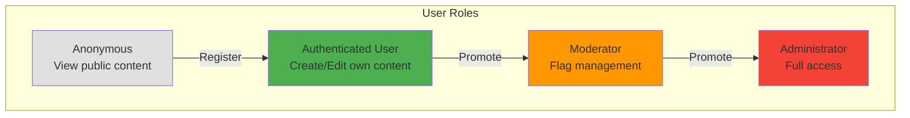
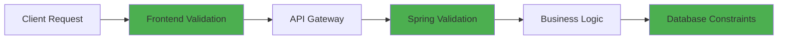
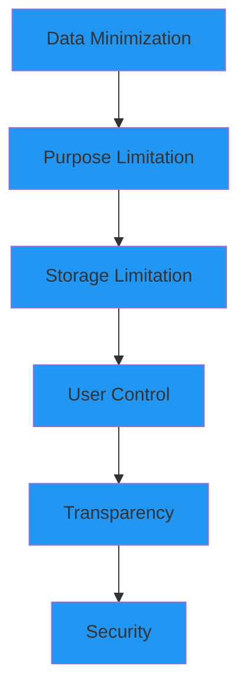
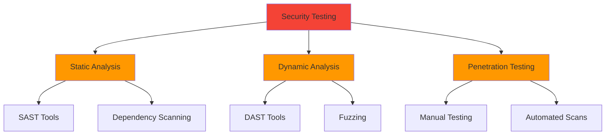
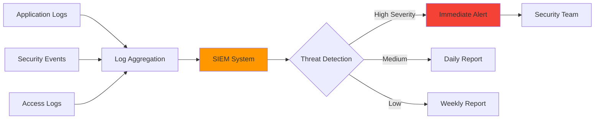
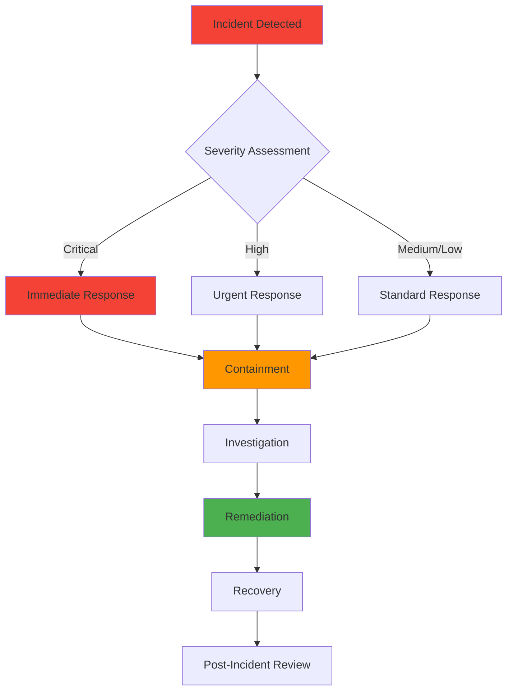

# 🔐 Krawl MVP - Security Plan

> **Version:** 1.0.0  
> **Last Updated:** October 28, 2025  
> **Status:** Active

This document outlines the security measures and practices for the Krawl MVP PWA to protect user data, maintain application integrity, and ensure service availability.

---

## 📋 Table of Contents

1. [Authentication & Authorization](#1-authentication--authorization)
2. [Data Security & Encryption](#2-data-security--encryption)
3. [API Security](#3-api-security)
4. [Infrastructure Security](#4-infrastructure-security)
5. [Privacy & Compliance](#5-privacy--compliance)
6. [Input Validation & Sanitization](#6-input-validation--sanitization)
7. [Security Testing](#7-security-testing)
8. [Monitoring & Incident Response](#8-monitoring--incident-response)
9. [Security Checklist](#9-security-checklist)

---

## 1. Authentication & Authorization

### 1.1 User Authentication

#### 🔑 Password Management

**Hashing Algorithm:** BCrypt with cost factor 12

```java
// Spring Boot Implementation
@Service
public class PasswordService {
    private final BCryptPasswordEncoder encoder = 
        new BCryptPasswordEncoder(12); // Cost factor 12
    
    public String hashPassword(String plaintext) {
        return encoder.encode(plaintext);
    }
    
    public boolean verifyPassword(String plaintext, String hashed) {
        return encoder.matches(plaintext, hashed);
    }
}
```

**Password Requirements:**

| Requirement | Rule |
|-------------|------|
| **Minimum Length** | 8 characters |
| **Complexity** | Must include: uppercase, lowercase, number |
| **Common Passwords** | Blocked (check against top 10,000 list) |
| **Storage** | Never stored in plaintext |
| **Transmission** | Only over HTTPS |

---

#### 🎫 JWT Token Management

**Token Structure:**

```json
{
  "header": {
    "alg": "HS256",
    "typ": "JWT"
  },
  "payload": {
    "userId": "uuid-123",
    "email": "user@example.com",
    "iat": 1698508800,
    "exp": 1698595200
  },
  "signature": "HMACSHA256(...)"
}
```

**Token Lifecycle:**

| Token Type | Expiration | Storage | Purpose |
|------------|-----------|---------|---------|
| **Access Token** | 24 hours | localStorage/memory | API authentication |
| **Refresh Token** | 30 days | HttpOnly cookie | Token renewal |

**Implementation:**

```java
@Component
public class JwtTokenProvider {
    @Value("${jwt.secret}")
    private String jwtSecret;
    
    @Value("${jwt.expiration}")
    private long jwtExpiration = 86400000; // 24 hours
    
    public String generateToken(Authentication auth) {
        UserPrincipal principal = (UserPrincipal) auth.getPrincipal();
        Date now = new Date();
        Date expiryDate = new Date(now.getTime() + jwtExpiration);
        
        return Jwts.builder()
            .setSubject(principal.getId().toString())
            .setIssuedAt(now)
            .setExpiration(expiryDate)
            .signWith(SignatureAlgorithm.HS256, jwtSecret)
            .compact();
    }
    
    public boolean validateToken(String token) {
        try {
            Jwts.parser().setSigningKey(jwtSecret).parseClaimsJws(token);
            return true;
        } catch (JwtException | IllegalArgumentException e) {
            return false;
        }
    }
}
```

---

### 1.2 Authorization & Access Control

#### 🛡️ Role-Based Access Control (RBAC)



**Permission Matrix:**

| Resource | Anonymous | User | Moderator | Admin |
|----------|-----------|------|-----------|-------|
| **View Gems** | ✅ Read | ✅ Read | ✅ Read | ✅ Read |
| **Create Gem** | ❌ | ✅ | ✅ | ✅ |
| **Edit Gem** | ❌ | ✅ Own only | ✅ Any | ✅ Any |
| **Delete Gem** | ❌ | ✅ Own only | ✅ Flagged | ✅ Any |
| **Vouch for Gem** | ❌ | ✅ | ✅ | ✅ |
| **Rate Gem** | ❌ | ✅ | ✅ | ✅ |
| **Create Krawl** | ❌ | ✅ | ✅ | ✅ |
| **Edit Krawl** | ❌ | ✅ Own only | ✅ Any | ✅ Any |
| **Delete Krawl** | ❌ | ✅ Own only | ✅ Flagged | ✅ Any |
| **Review Reports** | ❌ | ❌ | ✅ | ✅ |
| **Ban Users** | ❌ | ❌ | ❌ | ✅ |

**Spring Security Configuration:**

```java
@Configuration
@EnableWebSecurity
public class SecurityConfig extends WebSecurityConfigurerAdapter {
    
    @Override
    protected void configure(HttpSecurity http) throws Exception {
        http
            .csrf().disable()
            .sessionManagement()
                .sessionCreationPolicy(SessionCreationPolicy.STATELESS)
            .and()
            .authorizeRequests()
                .antMatchers("/api/auth/**").permitAll()
                .antMatchers(HttpMethod.GET, "/api/gems/**").permitAll()
                .antMatchers(HttpMethod.GET, "/api/krawls/**").permitAll()
                .antMatchers(HttpMethod.POST, "/api/gems/**").authenticated()
                .antMatchers(HttpMethod.POST, "/api/krawls/**").authenticated()
                .antMatchers("/api/admin/**").hasRole("ADMIN")
                .antMatchers("/api/moderation/**").hasAnyRole("MODERATOR", "ADMIN")
                .anyRequest().authenticated()
            .and()
            .addFilterBefore(jwtAuthFilter, UsernamePasswordAuthenticationFilter.class);
    }
}
```

---

### 1.3 Session Management

**Best Practices:**

```
┌─────────────────────────────────────────────────────────┐
│  🔐 Session Security                                     │
├─────────────────────────────────────────────────────────┤
│                                                          │
│  ✓ No server-side sessions (stateless JWT)             │
│  ✓ Token stored in memory or localStorage              │
│  ✓ Refresh tokens in HttpOnly cookies                  │
│  ✓ Automatic token refresh before expiration           │
│  ✓ Logout invalidates tokens (blacklist)               │
│  ✓ Forced logout after password change                 │
│  ✓ Session timeout: 24 hours of inactivity             │
│  ✓ Maximum session lifetime: 30 days                   │
│                                                          │
└─────────────────────────────────────────────────────────┘
```

---

## 2. Data Security & Encryption

### 2.1 Data Encryption

#### 🔒 Encryption Standards

**Data at Rest:**

| Data Type | Encryption Method | Key Management |
|-----------|------------------|----------------|
| **Passwords** | BCrypt (one-way hash) | N/A (irreversible) |
| **Sensitive User Data** | AES-256-GCM | AWS KMS / Cloud Key Mgmt |
| **Database Backups** | AES-256 | Encrypted storage |
| **File Uploads** | AES-256 (if needed) | Cloud provider encryption |

**Data in Transit:**

```
┌────────────────────────────────────────────────┐
│  🌐 Transport Layer Security (TLS)             │
├────────────────────────────────────────────────┤
│                                                │
│  Protocol:     TLS 1.3 (minimum TLS 1.2)      │
│  Cipher Suite: ECDHE-RSA-AES256-GCM-SHA384    │
│  Certificate:  Let's Encrypt (auto-renewed)   │
│  HSTS:         Enabled (max-age=31536000)     │
│  HTTPS Only:   Enforced (HTTP → HTTPS)        │
│                                                │
└────────────────────────────────────────────────┘
```

**Frontend Enforcement (Next.js):**

```javascript
// next.config.ts
const nextConfig = {
  async headers() {
    return [
      {
        source: '/(.*)',
        headers: [
          {
            key: 'Strict-Transport-Security',
            value: 'max-age=31536000; includeSubDomains; preload'
          },
          {
            key: 'X-Frame-Options',
            value: 'DENY'
          },
          {
            key: 'X-Content-Type-Options',
            value: 'nosniff'
          },
          {
            key: 'X-XSS-Protection',
            value: '1; mode=block'
          },
          {
            key: 'Referrer-Policy',
            value: 'strict-origin-when-cross-origin'
          }
        ]
      }
    ];
  }
};
```

---

### 2.2 Database Security

#### 🗄️ PostgreSQL Hardening

**Access Control:**

```sql
-- Create application user with limited privileges
CREATE USER krawl_app WITH PASSWORD 'strong_random_password';

-- Grant only necessary permissions
GRANT CONNECT ON DATABASE krawl_db TO krawl_app;
GRANT USAGE ON SCHEMA public TO krawl_app;
GRANT SELECT, INSERT, UPDATE, DELETE ON ALL TABLES IN SCHEMA public TO krawl_app;
GRANT USAGE, SELECT ON ALL SEQUENCES IN SCHEMA public TO krawl_app;

-- Revoke dangerous permissions
REVOKE CREATE ON SCHEMA public FROM PUBLIC;
REVOKE ALL ON pg_user FROM PUBLIC;
```

**Connection Security:**

| Setting | Value | Purpose |
|---------|-------|---------|
| **SSL Mode** | `require` or `verify-full` | Encrypted connections |
| **Max Connections** | 100 | Prevent resource exhaustion |
| **Connection Timeout** | 10 seconds | Avoid hanging connections |
| **Password Encryption** | SCRAM-SHA-256 | Secure authentication |

**Prepared Statements (SQL Injection Prevention):**

```java
// ✅ SAFE: Using JPA Repository
@Repository
public interface GemRepository extends JpaRepository<Gem, UUID> {
    @Query("SELECT g FROM Gem g WHERE g.name LIKE %:name%")
    List<Gem> findByNameContaining(@Param("name") String name);
}

// ✅ SAFE: Using JDBC with PreparedStatement
String sql = "SELECT * FROM gems WHERE name = ?";
PreparedStatement stmt = connection.prepareStatement(sql);
stmt.setString(1, userInput);

// ❌ UNSAFE: String concatenation
String sql = "SELECT * FROM gems WHERE name = '" + userInput + "'"; // NEVER DO THIS!
```

---

### 2.3 Sensitive Data Handling

**Data Classification:**

```
┌───────────────────────────────────────────────────────┐
│  📊 Data Sensitivity Levels                           │
├───────────────────────────────────────────────────────┤
│                                                       │
│  🔴 CRITICAL (Encrypted at rest)                     │
│     • Passwords (hashed)                             │
│     • Payment information (if implemented)           │
│     • API keys & secrets                             │
│                                                       │
│  🟡 SENSITIVE (Access controlled)                    │
│     • Email addresses                                │
│     • User profiles                                  │
│     • Private Krawls                                 │
│                                                       │
│  🟢 PUBLIC (No restrictions)                         │
│     • Public Gems                                    │
│     • Public Krawls                                  │
│     • User ratings/vouches                           │
│                                                       │
└───────────────────────────────────────────────────────┘
```

**PII (Personally Identifiable Information) Protection:**

- ✅ Email addresses are never exposed in public APIs
- ✅ User IDs are UUIDs (not sequential integers)
- ✅ GPS coordinates are only stored for Gems (not user tracking)
- ✅ IP addresses are logged but not stored long-term
- ✅ User location data remains client-side only

---

## 3. API Security

### 3.1 Rate Limiting

**Throttling Strategy:**

| Endpoint Category | Rate Limit | Time Window | Action on Exceed |
|-------------------|------------|-------------|------------------|
| **Authentication** | 5 requests | 15 minutes | Block for 1 hour |
| **Gem Creation** | 10 gems | 1 hour | HTTP 429 + warning |
| **Krawl Creation** | 5 krawls | 1 hour | HTTP 429 |
| **Ratings/Vouches** | 50 actions | 1 hour | HTTP 429 |
| **General API** | 100 requests | 1 minute | HTTP 429 |
| **Search/Browse** | 200 requests | 1 minute | HTTP 429 |

**Spring Boot Implementation:**

```java
@Configuration
public class RateLimitConfig {
    
    @Bean
    public RateLimiter authRateLimiter() {
        return RateLimiter.of("auth", RateLimiterConfig.custom()
            .limitForPeriod(5)
            .limitRefreshPeriod(Duration.ofMinutes(15))
            .timeoutDuration(Duration.ofSeconds(5))
            .build());
    }
    
    @Aspect
    @Component
    public class RateLimitAspect {
        @Around("@annotation(RateLimited)")
        public Object rateLimit(ProceedingJoinPoint joinPoint) throws Throwable {
            String clientId = getClientIdentifier();
            if (!rateLimiter.tryAcquirePermission(clientId)) {
                throw new RateLimitExceededException("Too many requests");
            }
            return joinPoint.proceed();
        }
    }
}
```

---

### 3.2 CORS (Cross-Origin Resource Sharing)

**Configuration:**

```java
@Configuration
public class CorsConfig {
    
    @Bean
    public WebMvcConfigurer corsConfigurer() {
        return new WebMvcConfigurer() {
            @Override
            public void addCorsMappings(CorsRegistry registry) {
                registry.addMapping("/api/**")
                    .allowedOrigins(
                        "https://krawl.app",           // Production
                        "https://staging.krawl.app",   // Staging
                        "http://localhost:3000"        // Development
                    )
                    .allowedMethods("GET", "POST", "PUT", "DELETE", "OPTIONS")
                    .allowedHeaders("Authorization", "Content-Type")
                    .allowCredentials(true)
                    .maxAge(3600);
            }
        };
    }
}
```

**Security Rules:**

```
┌─────────────────────────────────────────────────┐
│  🌐 CORS Security Policy                        │
├─────────────────────────────────────────────────┤
│                                                 │
│  ✓ Whitelist specific origins only             │
│  ✓ No wildcard (*) in production               │
│  ✓ Credentials allowed only for trusted origins│
│  ✓ Preflight requests cached (1 hour)          │
│  ✓ Expose only necessary headers               │
│                                                 │
└─────────────────────────────────────────────────┘
```

---

### 3.3 API Request Validation

**Input Validation Layers:**



**Validation Example:**

```java
@RestController
@RequestMapping("/api/gems")
@Validated
public class GemController {
    
    @PostMapping
    public ResponseEntity<GemDTO> createGem(
        @Valid @RequestBody CreateGemRequest request,
        @AuthenticationPrincipal UserPrincipal user
    ) {
        // Request is automatically validated before reaching this point
        Gem gem = gemService.createGem(request, user.getId());
        return ResponseEntity.status(HttpStatus.CREATED).body(toDTO(gem));
    }
}

// Request DTO with validation annotations
public class CreateGemRequest {
    
    @NotBlank(message = "Gem name is required")
    @Size(min = 3, max = 255, message = "Name must be 3-255 characters")
    private String name;
    
    @Size(max = 2000, message = "Description cannot exceed 2000 characters")
    private String description;
    
    @NotNull(message = "Latitude is required")
    @DecimalMin(value = "-90.0", message = "Invalid latitude")
    @DecimalMax(value = "90.0", message = "Invalid latitude")
    private Double latitude;
    
    @NotNull(message = "Longitude is required")
    @DecimalMin(value = "-180.0", message = "Invalid longitude")
    @DecimalMax(value = "180.0", message = "Invalid longitude")
    private Double longitude;
    
    @Size(max = 10, message = "Maximum 10 tags allowed")
    private List<@NotBlank @Size(max = 50) String> tags;
}
```

---

## 4. Infrastructure Security

### 4.1 Deployment Security

**Environment Configuration:**

| Environment | Access Level | Security Measures |
|-------------|--------------|-------------------|
| **Production** | Restricted | MFA required, audit logs, encrypted secrets |
| **Staging** | Team only | VPN access, encrypted secrets |
| **Development** | Local only | Mock data, no sensitive info |

**Secrets Management:**

```bash
# ❌ NEVER commit secrets to Git
DATABASE_PASSWORD=secret123

# ✅ Use environment variables
DATABASE_URL=${DB_URL}
JWT_SECRET=${JWT_SECRET}

# ✅ Use cloud secret managers
# AWS Secrets Manager, Google Secret Manager, Azure Key Vault
```

**application.yml (Production):**

```yaml
spring:
  datasource:
    url: ${DATABASE_URL}
    username: ${DB_USERNAME}
    password: ${DB_PASSWORD}
  
jwt:
  secret: ${JWT_SECRET}
  expiration: ${JWT_EXPIRATION:86400000}

security:
  allowed-origins:
    - ${FRONTEND_URL}
```

---

### 4.2 Container & Server Security

**Docker Security Best Practices:**

```dockerfile
# Use official, minimal base images
FROM eclipse-temurin:17-jre-alpine AS production

# Run as non-root user
RUN addgroup -g 1001 -S appuser && adduser -u 1001 -S appuser -G appuser
USER appuser

# Copy only necessary files
COPY --chown=appuser:appuser target/krawl-api.jar app.jar

# Expose only necessary ports
EXPOSE 8080

# Health check
HEALTHCHECK --interval=30s --timeout=3s \
  CMD wget --no-verbose --tries=1 --spider http://localhost:8080/actuator/health || exit 1

# Run application
ENTRYPOINT ["java", "-jar", "app.jar"]
```

**Security Checklist:**

```
┌───────────────────────────────────────────────┐
│  🔒 Infrastructure Security Checklist         │
├───────────────────────────────────────────────┤
│                                               │
│  ✅ Firewall configured (allow only 80, 443) │
│  ✅ SSH access restricted (key-based only)   │
│  ✅ Automatic security updates enabled        │
│  ✅ Intrusion detection system (IDS) active   │
│  ✅ Regular vulnerability scans               │
│  ✅ DDoS protection enabled                   │
│  ✅ Web Application Firewall (WAF) configured │
│  ✅ Load balancer with SSL termination        │
│  ✅ Container image scanning                  │
│  ✅ Dependency vulnerability monitoring       │
│                                               │
└───────────────────────────────────────────────┘
```

---

### 4.3 Database Backup & Recovery

**Backup Strategy:**

| Backup Type | Frequency | Retention | Encryption |
|-------------|-----------|-----------|------------|
| **Full Backup** | Daily (3 AM UTC) | 30 days | AES-256 |
| **Incremental** | Every 6 hours | 7 days | AES-256 |
| **Transaction Logs** | Continuous | 7 days | AES-256 |

**Disaster Recovery Plan:**

```
┌────────────────────────────────────────────────┐
│  🚨 Disaster Recovery Metrics                  │
├────────────────────────────────────────────────┤
│                                                │
│  RTO (Recovery Time Objective):    4 hours    │
│  RPO (Recovery Point Objective):   1 hour     │
│                                                │
│  Backup Storage:                               │
│  • Primary: Cloud storage (encrypted)         │
│  • Secondary: Different region (georedundant) │
│                                                │
│  Testing:                                      │
│  • Backup restoration test: Monthly           │
│  • Full DR drill: Quarterly                   │
│                                                │
└────────────────────────────────────────────────┘
```

---

## 5. Privacy & Compliance

### 5.1 Data Privacy Principles

**Privacy by Design:**



---

### 5.2 User Rights & Data Management

**GDPR/Privacy Compliance:**

| User Right | Implementation | API Endpoint |
|------------|----------------|--------------|
| **Right to Access** | Export all user data | `GET /api/users/me/export` |
| **Right to Rectification** | Edit profile/content | `PUT /api/users/me` |
| **Right to Erasure** | Delete account & data | `DELETE /api/users/me` |
| **Right to Portability** | JSON export | `GET /api/users/me/export` |
| **Right to Object** | Opt-out of analytics | `PUT /api/users/me/preferences` |

**Data Retention Policy:**

```
┌────────────────────────────────────────────────┐
│  📅 Data Retention Schedule                    │
├────────────────────────────────────────────────┤
│                                                │
│  Active Users:                                 │
│  • Profile data: Indefinite (until deletion)  │
│  • Activity logs: 90 days                     │
│  • IP addresses: 30 days                      │
│                                                │
│  Deleted Users:                                │
│  • Personal data: Immediate deletion          │
│  • Content: Anonymized (user ID removed)      │
│  • Backups: Purged within 30 days             │
│                                                │
│  Audit Logs:                                   │
│  • Security events: 1 year                    │
│  • Admin actions: 2 years                     │
│                                                │
└────────────────────────────────────────────────┘
```

**Account Deletion Implementation:**

```java
@Service
public class UserDeletionService {
    
    @Transactional
    public void deleteUserAccount(UUID userId) {
        User user = userRepository.findById(userId)
            .orElseThrow(() -> new NotFoundException("User not found"));
        
        // 1. Anonymize user's content (keep Gems/Krawls but remove association)
        gemRepository.anonymizeUserGems(userId);
        krawlRepository.anonymizeUserKrawls(userId);
        
        // 2. Delete personal data
        user.setEmail("deleted-" + UUID.randomUUID() + "@deleted.local");
        user.setUsername("deleted_user_" + userId.toString().substring(0, 8));
        user.setPasswordHash(null);
        user.setBio(null);
        user.setDeleted(true);
        userRepository.save(user);
        
        // 3. Remove from all relationships
        vouchRepository.deleteByUserId(userId);
        ratingRepository.deleteByUserId(userId);
        
        // 4. Revoke all tokens
        tokenBlacklist.addToBlacklist(userId);
        
        // 5. Log the deletion for audit purposes
        auditService.logAccountDeletion(userId);
    }
}
```

---

### 5.3 Cookie Policy

**Cookie Usage:**

| Cookie Name | Type | Purpose | Expiration | HttpOnly | Secure |
|-------------|------|---------|------------|----------|--------|
| `refresh_token` | Essential | Token refresh | 30 days | ✅ Yes | ✅ Yes |
| `session_id` | Essential | Session tracking | Session | ✅ Yes | ✅ Yes |
| `preferences` | Functional | User preferences | 1 year | ❌ No | ✅ Yes |
| `analytics` | Analytics | Usage tracking | 1 year | ❌ No | ✅ Yes |

**Cookie Consent:**

```javascript
// Frontend implementation
const cookieConsent = {
  essential: true,    // Always enabled
  functional: false,  // Opt-in
  analytics: false    // Opt-in (default off)
};

// Only set non-essential cookies after consent
if (userConsent.analytics) {
  analytics.initialize();
}
```

---

## 6. Input Validation & Sanitization

### 6.1 XSS (Cross-Site Scripting) Prevention

**Output Encoding:**

```javascript
// ✅ React automatically escapes content
function GemCard({ gem }) {
  return (
    <div>
      <h3>{gem.name}</h3> {/* Auto-escaped */}
      <p>{gem.description}</p> {/* Auto-escaped */}
    </div>
  );
}

// ⚠️ Dangerous: Only use with sanitized content
function RichTextDisplay({ htmlContent }) {
  // Sanitize before rendering
  const sanitized = DOMPurify.sanitize(htmlContent);
  return <div dangerouslySetInnerHTML={{ __html: sanitized }} />;
}
```

**Backend Sanitization:**

```java
@Component
public class InputSanitizer {
    
    private final PolicyFactory policy = new HtmlPolicyBuilder()
        .allowElements("p", "br", "strong", "em")
        .allowAttributes("href").onElements("a")
        .toFactory();
    
    public String sanitizeHtml(String input) {
        if (input == null) return null;
        return policy.sanitize(input);
    }
    
    public String escapeHtml(String input) {
        if (input == null) return null;
        return StringEscapeUtils.escapeHtml4(input);
    }
}
```

---

### 6.2 SQL Injection Prevention

**Safe Practices:**

```
┌────────────────────────────────────────────────┐
│  ✅ SQL Injection Prevention Strategies        │
├────────────────────────────────────────────────┤
│                                                │
│  1. Use ORM (JPA/Hibernate) - PREFERRED       │
│  2. Use prepared statements - ALWAYS           │
│  3. Use parameterized queries - ALWAYS         │
│  4. Validate/sanitize all input - ALWAYS       │
│  5. Never concatenate SQL strings - NEVER      │
│  6. Principle of least privilege - ALWAYS      │
│  7. Use stored procedures - WHEN APPROPRIATE   │
│                                                │
└────────────────────────────────────────────────┘
```

---

### 6.3 NoSQL Injection Prevention

**Secure Geospatial Queries:**

```java
// ✅ Safe: Using JPA with PostGIS
@Query(value = """
    SELECT g.* FROM gems g 
    WHERE ST_DWithin(
        g.location::geography,
        ST_SetSRID(ST_MakePoint(:longitude, :latitude), 4326)::geography,
        :radiusMeters
    )
    """, nativeQuery = true)
List<Gem> findGemsNearLocation(
    @Param("latitude") Double latitude,
    @Param("longitude") Double longitude,
    @Param("radiusMeters") Integer radiusMeters
);

// ❌ Unsafe: String concatenation
String query = "SELECT * FROM gems WHERE ST_DWithin(location, " + userInput + ")"; // NEVER!
```

---

## 7. Security Testing

### 7.1 Testing Strategy



---

### 7.2 Security Testing Tools

**Automated Security Scanning:**

| Tool | Type | Purpose | Frequency |
|------|------|---------|-----------|
| **SonarQube** | SAST | Code quality & vulnerabilities | Every commit |
| **OWASP Dependency-Check** | SCA | Vulnerable dependencies | Daily |
| **npm audit** | SCA | Frontend dependencies | Pre-deploy |
| **Snyk** | SCA/Container | Vulnerabilities & containers | Daily |
| **OWASP ZAP** | DAST | Dynamic application testing | Weekly |
| **Burp Suite** | Manual | Penetration testing | Monthly |

**GitHub Actions Security Workflow:**

```yaml
name: Security Scan

on:
  push:
    branches: [main, develop]
  pull_request:
    branches: [main]
  schedule:
    - cron: '0 2 * * *'  # Daily at 2 AM

jobs:
  security-scan:
    runs-on: ubuntu-latest
    steps:
      - uses: actions/checkout@v3
      
      - name: Run dependency check
        run: |
          mvn org.owasp:dependency-check-maven:check
      
      - name: Run Snyk scan
        uses: snyk/actions/maven@master
        env:
          SNYK_TOKEN: ${{ secrets.SNYK_TOKEN }}
      
      - name: Run Trivy vulnerability scanner
        uses: aquasecurity/trivy-action@master
        with:
          scan-type: 'fs'
          scan-ref: '.'
          format: 'sarif'
          output: 'trivy-results.sarif'
      
      - name: Upload results to GitHub Security
        uses: github/codeql-action/upload-sarif@v2
        with:
          sarif_file: 'trivy-results.sarif'
```

---

### 7.3 Security Test Cases

**Authentication Testing:**

| Test Case | Expected Result |
|-----------|----------------|
| Login with invalid credentials | HTTP 401, no token issued |
| Login with valid credentials | HTTP 200, JWT token returned |
| Access protected endpoint without token | HTTP 401 Unauthorized |
| Access protected endpoint with expired token | HTTP 401, "Token expired" |
| Access protected endpoint with malformed token | HTTP 401, "Invalid token" |
| Password reset with invalid email | HTTP 404 or generic message |
| Register with weak password | HTTP 400, validation error |
| Register with existing email | HTTP 409 Conflict |

**Authorization Testing:**

| Test Case | Expected Result |
|-----------|----------------|
| User edits own Gem | HTTP 200, Gem updated |
| User edits another user's Gem | HTTP 403 Forbidden |
| Anonymous user creates Gem | HTTP 401 Unauthorized |
| User deletes own Krawl | HTTP 204 No Content |
| User deletes another user's Krawl | HTTP 403 Forbidden |
| Admin deletes any content | HTTP 204 No Content |

**Input Validation Testing:**

| Test Case | Input | Expected Result |
|-----------|-------|----------------|
| XSS in Gem name | `<script>alert('xss')</script>` | Sanitized/escaped |
| SQL injection in search | `' OR '1'='1` | No SQL error, safe query |
| Overlong Gem name | 10,000 characters | HTTP 400, validation error |
| Invalid coordinates | `lat: 999, lng: -999` | HTTP 400, validation error |
| Negative rating | `rating: -5` | HTTP 400, validation error |
| HTML in description | `<b>Bold</b> text` | Sanitized (allowed tags only) |

**Rate Limiting Testing:**

| Test Case | Expected Result |
|-----------|----------------|
| 6 login attempts in 15 min | 6th request returns HTTP 429 |
| 11 Gem creations in 1 hour | 11th request returns HTTP 429 |
| 101 API requests in 1 minute | 101st request returns HTTP 429 |

---

### 7.4 Penetration Testing Checklist

```
┌──────────────────────────────────────────────────────┐
│  🎯 Penetration Testing Checklist (Pre-Launch)      │
├──────────────────────────────────────────────────────┤
│                                                      │
│  Authentication & Session Management:                │
│  ☐ Test password strength requirements              │
│  ☐ Test account lockout mechanism                   │
│  ☐ Test password reset flow                         │
│  ☐ Test JWT token manipulation                      │
│  ☐ Test session fixation                            │
│  ☐ Test concurrent session handling                 │
│                                                      │
│  Authorization:                                      │
│  ☐ Test IDOR (Insecure Direct Object Reference)    │
│  ☐ Test privilege escalation                        │
│  ☐ Test horizontal authorization bypass             │
│  ☐ Test vertical authorization bypass               │
│                                                      │
│  Input Validation:                                   │
│  ☐ Test XSS (reflected, stored, DOM-based)         │
│  ☐ Test SQL injection                               │
│  ☐ Test NoSQL injection                             │
│  ☐ Test command injection                           │
│  ☐ Test path traversal                              │
│  ☐ Test file upload vulnerabilities                 │
│                                                      │
│  Business Logic:                                     │
│  ☐ Test duplicate Gem creation bypass              │
│  ☐ Test rating/vouch manipulation                   │
│  ☐ Test race conditions                             │
│  ☐ Test payment logic (if applicable)              │
│                                                      │
│  API Security:                                       │
│  ☐ Test rate limiting effectiveness                 │
│  ☐ Test CORS configuration                          │
│  ☐ Test mass assignment                             │
│  ☐ Test API endpoint enumeration                    │
│  ☐ Test GraphQL introspection (if applicable)      │
│                                                      │
│  Infrastructure:                                     │
│  ☐ Test SSL/TLS configuration                       │
│  ☐ Test HTTP security headers                       │
│  ☐ Test subdomain takeover                          │
│  ☐ Test SSRF (Server-Side Request Forgery)         │
│  ☐ Test information disclosure                      │
│                                                      │
└──────────────────────────────────────────────────────┘
```

---

## 8. Monitoring & Incident Response

### 8.1 Security Monitoring

**Real-time Alerting:**



**Security Metrics to Monitor:**

| Metric | Threshold | Alert Level |
|--------|-----------|-------------|
| **Failed login attempts** | > 5 per user in 15 min | 🟡 Medium |
| **Failed login attempts** | > 100 per IP in 1 hour | 🔴 High |
| **API error rate** | > 5% of requests | 🟡 Medium |
| **Unauthorized access attempts** | > 10 per minute | 🔴 High |
| **Unusual data export requests** | Any bulk export | 🟡 Medium |
| **Admin actions** | All actions | 🟢 Info (audit) |
| **Database connection failures** | > 5 in 5 minutes | 🔴 High |
| **Rate limit violations** | > 50 per IP in 1 hour | 🟡 Medium |

---

### 8.2 Logging & Audit Trail

**Logging Strategy:**

```java
@Aspect
@Component
public class SecurityAuditAspect {
    
    private static final Logger securityLogger = 
        LoggerFactory.getLogger("SECURITY_AUDIT");
    
    @AfterReturning("@annotation(AuditLog)")
    public void logSecurityEvent(JoinPoint joinPoint, AuditLog auditLog) {
        String username = SecurityContextHolder.getContext()
            .getAuthentication().getName();
        String action = auditLog.action();
        String resource = auditLog.resource();
        String ipAddress = getClientIpAddress();
        
        securityLogger.info(
            "Security Event | User: {} | Action: {} | Resource: {} | IP: {} | Timestamp: {}",
            username, action, resource, ipAddress, Instant.now()
        );
    }
    
    @AfterThrowing(pointcut = "@annotation(AuditLog)", throwing = "ex")
    public void logSecurityFailure(JoinPoint joinPoint, AuditLog auditLog, Exception ex) {
        securityLogger.error(
            "Security Failure | Action: {} | Error: {} | Timestamp: {}",
            auditLog.action(), ex.getMessage(), Instant.now()
        );
    }
}
```

**Events to Log:**

```
┌────────────────────────────────────────────────┐
│  📝 Security Audit Log Requirements            │
├────────────────────────────────────────────────┤
│                                                │
│  Authentication Events:                        │
│  • Login attempts (success/failure)           │
│  • Logout events                              │
│  • Password changes                           │
│  • Token generation/refresh                   │
│                                                │
│  Authorization Events:                         │
│  • Access denied (403) attempts               │
│  • Role changes                               │
│  • Permission violations                      │
│                                                │
│  Data Access Events:                           │
│  • Sensitive data access                      │
│  • Bulk data exports                          │
│  • User account deletions                     │
│  • Content deletions                          │
│                                                │
│  Admin Actions:                                │
│  • All admin operations                       │
│  • Configuration changes                      │
│  • User bans/unbans                           │
│                                                │
│  Security Incidents:                           │
│  • Rate limit violations                      │
│  • Validation failures (potential attacks)    │
│  • Unusual API usage patterns                 │
│                                                │
│  Log Format:                                   │
│  [Timestamp] [Level] [User] [IP] [Action]     │
│                                                │
│  Retention: 1 year (security logs)            │
│                                                │
└────────────────────────────────────────────────┘
```

---

### 8.3 Incident Response Plan

**Incident Severity Levels:**

| Level | Definition | Response Time | Example |
|-------|------------|---------------|---------|
| **🔴 Critical** | Data breach, system compromise | < 1 hour | Database exposed, mass account takeover |
| **🟠 High** | Service disruption, vulnerability exploit | < 4 hours | DDoS attack, successful XSS exploitation |
| **🟡 Medium** | Security issue affecting some users | < 24 hours | Rate limit bypass, minor data leak |
| **🟢 Low** | Security concern with minimal impact | < 72 hours | Outdated dependency, configuration issue |

**Incident Response Workflow:**



**Response Team Contacts:**

```
┌────────────────────────────────────────────────┐
│  🚨 Security Incident Response Team            │
├────────────────────────────────────────────────┤
│                                                │
│  Primary Contact: security@krawl.app          │
│  Phone: [Emergency Hotline]                   │
│                                                │
│  Team Roles:                                   │
│  • Incident Commander                         │
│  • Technical Lead                             │
│  • Communications Lead                        │
│  • Legal/Compliance Advisor                   │
│                                                │
│  Escalation Path:                              │
│  L1: Security Engineer → 15 min               │
│  L2: Security Lead → 1 hour                   │
│  L3: CTO/CEO → 4 hours                        │
│                                                │
└────────────────────────────────────────────────┘
```

**Incident Response Playbooks:**

### Playbook 1: Data Breach Response

```
1. IMMEDIATE (< 1 hour):
   ☐ Isolate affected systems
   ☐ Preserve evidence (logs, snapshots)
   ☐ Assess scope of breach
   ☐ Notify incident commander

2. SHORT-TERM (< 24 hours):
   ☐ Contain breach (patch vulnerability)
   ☐ Force password resets if needed
   ☐ Review access logs
   ☐ Determine affected users

3. REMEDIATION (< 72 hours):
   ☐ Implement fixes
   ☐ Notify affected users
   ☐ Report to authorities (if required)
   ☐ Update security measures

4. POST-INCIDENT:
   ☐ Conduct root cause analysis
   ☐ Update security policies
   ☐ Retrain staff if needed
   ☐ Document lessons learned
```

### Playbook 2: DDoS Attack Response

```
1. DETECTION:
   ☐ Confirm attack (vs. legitimate traffic surge)
   ☐ Identify attack vector
   ☐ Assess impact

2. MITIGATION:
   ☐ Enable DDoS protection (Cloudflare, AWS Shield)
   ☐ Block attacking IPs
   ☐ Rate limit aggressively
   ☐ Scale infrastructure if needed

3. COMMUNICATION:
   ☐ Update status page
   ☐ Notify users of potential service impact
   ☐ Keep stakeholders informed

4. RECOVERY:
   ☐ Gradually restore service
   ☐ Monitor for resumption of attack
   ☐ Implement long-term DDoS protection
```

---

## 9. Security Checklist

### 9.1 Pre-Launch Security Checklist

```
┌──────────────────────────────────────────────────────┐
│  ✅ Pre-Launch Security Verification                 │
├──────────────────────────────────────────────────────┤
│                                                      │
│  AUTHENTICATION & AUTHORIZATION                      │
│  ☐ Password hashing with BCrypt (cost factor 12)   │
│  ☐ JWT token implementation secure                  │
│  ☐ RBAC properly configured                         │
│  ☐ Session management tested                        │
│  ☐ Account lockout after failed attempts           │
│                                                      │
│  DATA SECURITY                                       │
│  ☐ HTTPS enforced on all endpoints                 │
│  ☐ TLS 1.3 configured                              │
│  ☐ HSTS header enabled                             │
│  ☐ Database connections encrypted                   │
│  ☐ Sensitive data encrypted at rest                │
│  ☐ No secrets in codebase                          │
│                                                      │
│  API SECURITY                                        │
│  ☐ Rate limiting implemented                        │
│  ☐ CORS properly configured                         │
│  ☐ Input validation on all endpoints               │
│  ☐ Output encoding implemented                      │
│  ☐ API authentication tested                        │
│                                                      │
│  INFRASTRUCTURE                                      │
│  ☐ Firewall configured                              │
│  ☐ Unnecessary ports closed                         │
│  ☐ Security groups/ACLs configured                  │
│  ☐ Container security hardening                     │
│  ☐ Secrets management implemented                   │
│  ☐ Backup strategy in place                         │
│                                                      │
│  COMPLIANCE & PRIVACY                                │
│  ☐ Privacy policy published                         │
│  ☐ Cookie consent implemented                       │
│  ☐ Data export functionality working               │
│  ☐ Account deletion working                         │
│  ☐ Data retention policy documented                │
│                                                      │
│  MONITORING & LOGGING                                │
│  ☐ Security event logging configured               │
│  ☐ Log aggregation set up                          │
│  ☐ Alerting rules configured                       │
│  ☐ Incident response plan documented               │
│                                                      │
│  TESTING                                             │
│  ☐ Security test cases passed                       │
│  ☐ Penetration testing completed                    │
│  ☐ Vulnerability scan completed                     │
│  ☐ Dependency audit clean                           │
│  ☐ Code security review completed                   │
│                                                      │
└──────────────────────────────────────────────────────┘
```

---

### 9.2 Ongoing Security Tasks

**Daily:**
- ✅ Review security alerts
- ✅ Check failed login attempts
- ✅ Monitor error rates

**Weekly:**
- ✅ Run vulnerability scans
- ✅ Review access logs
- ✅ Check dependency updates

**Monthly:**
- ✅ Security patch updates
- ✅ Penetration testing
- ✅ Incident response drill
- ✅ Security awareness training

**Quarterly:**
- ✅ Full security audit
- ✅ Disaster recovery test
- ✅ Review security policies
- ✅ Third-party security assessment

---

## 📚 Security Resources & References

### Security Standards & Guidelines

- **OWASP Top 10** - https://owasp.org/www-project-top-ten/
- **OWASP API Security Top 10** - https://owasp.org/www-project-api-security/
- **CWE/SANS Top 25** - https://cwe.mitre.org/top25/
- **NIST Cybersecurity Framework** - https://www.nist.gov/cyberframework

### Tools & Libraries

- **Spring Security** - https://spring.io/projects/spring-security
- **OWASP Dependency-Check** - https://owasp.org/www-project-dependency-check/
- **Snyk** - https://snyk.io/
- **OWASP ZAP** - https://www.zaproxy.org/

### Security Communities

- **OWASP Foundation** - https://owasp.org/
- **Security Stack Exchange** - https://security.stackexchange.com/
- **Reddit r/netsec** - https://reddit.com/r/netsec

---

## 🔄 Document Maintenance

| Version | Date | Changes | Author |
|---------|------|---------|--------|
| 1.0.0 | Oct 28, 2025 | Initial security plan | Krawl Team |

**Next Review Date:** November 28, 2025

---

<div align="center">

**🔒 Security is not a feature, it's a foundation 🔒**

*Protecting Krawl users and their data is our top priority*

</div>

