# 🏗️ System Design: Krawl PWA

> **Purpose:** This document provides comprehensive system design documentation for Krawl, including architecture overview, component interactions, data flow diagrams, and technical design patterns for all major features.

**Version:** 1.0.0  
**Last Updated:** 2025-10-28  
**Status:** Active  
**Owner:** Development Team

---

## 📋 Table of Contents

1. [System Architecture Overview](#-system-architecture-overview)
2. [Core Components](#-core-components)
3. [Data Flow Diagrams](#-data-flow-diagrams)
4. [Security Architecture](#-security-architecture)
5. [Performance Optimization](#-performance-optimization)
6. [Scalability Considerations](#-scalability-considerations)

---

## 📐 System Architecture Overview

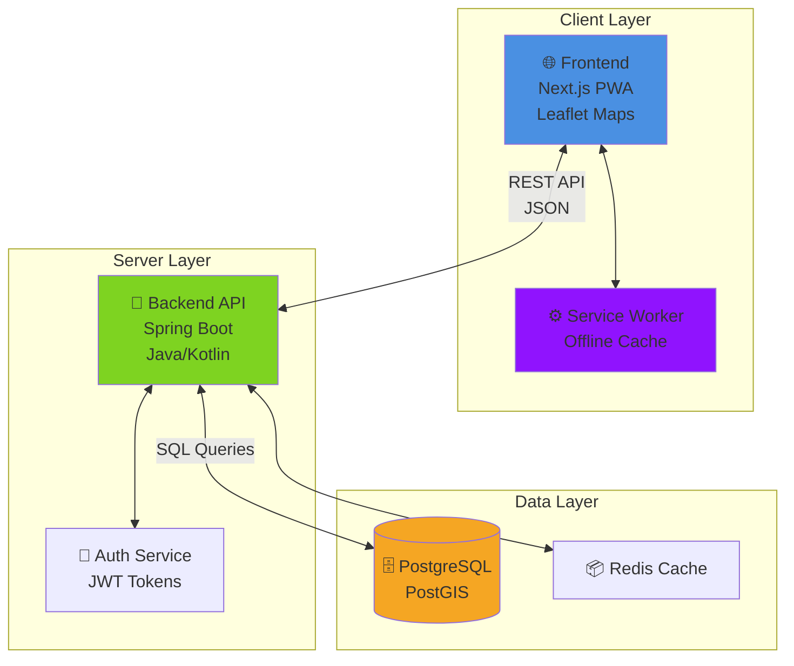

---

## 🧩 Core Components

### 🎨 Frontend (FE)
**Technology:** Next.js Progressive Web App (PWA)

**Responsibilities:**
- 🖼️ UI rendering and user interactions
- 🗺️ Map display using Leaflet.js
- 📡 API communication with backend
- 💾 Local data caching (IndexedDB)
- 📍 GPS location tracking
- 🔄 Offline functionality via Service Worker

**Key Libraries:**
- React / Next.js
- Leaflet.js (maps)
- PWA assets & manifest

---

### ⚡ Backend (BE)
**Technology:** Spring Boot (Java/Kotlin)

**Responsibilities:**
- 🔐 User authentication & authorization
- ✅ Data validation & business logic
- 🗃️ Database operations (CRUD)
- 🌍 Geospatial queries via PostGIS
- 🔍 Duplicate detection algorithms
- 📊 Rating & vouching calculations

**Key Endpoints:**
- `/api/auth/*` - Authentication
- `/api/gems/*` - Gem management
- `/api/krawls/*` - Krawl operations
- `/api/users/*` - User profiles

---

### 🗄️ Database (DB)
**Technology:** PostgreSQL + PostGIS Extension

**Responsibilities:**
- 💾 Persistent data storage
- 📍 Geospatial indexing & queries
- 🔍 Full-text search
- 🔗 Relational data management

**Key Tables:**
- `users` - User accounts
- `gems` - Location points
- `krawls` - Route collections
- `krawl_items` - Ordered stops
- `ratings` - User ratings
- `vouches` - Gem validations

---

## 🔄 Data Flow Diagrams

### 1️⃣ Initial App Load / View Map (`/`)

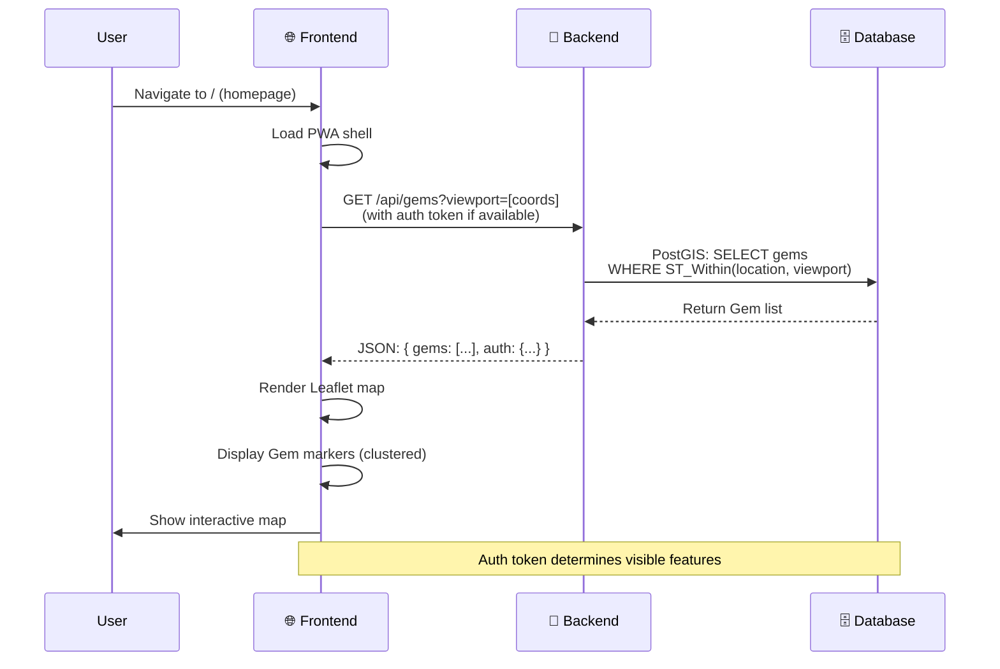

**Flow Steps:**

| Step | Actor | Action | Data |
|------|-------|--------|------|
| 1 | User | Navigates to Krawl URL | — |
| 2 | FE | Requests Gems in viewport | `viewport: [lat1, lng1, lat2, lng2]` |
| 3 | BE | Queries PostGIS for spatial data | `ST_Within()` query |
| 4 | DB | Returns matching Gems | `[{id, name, lat, lng, status}]` |
| 5 | BE | Sends Gem data + auth status | `{gems: [...], isAuthenticated: bool}` |
| 6 | FE | Renders map with markers | Leaflet.js clustering |

---

### 2️⃣ User Login

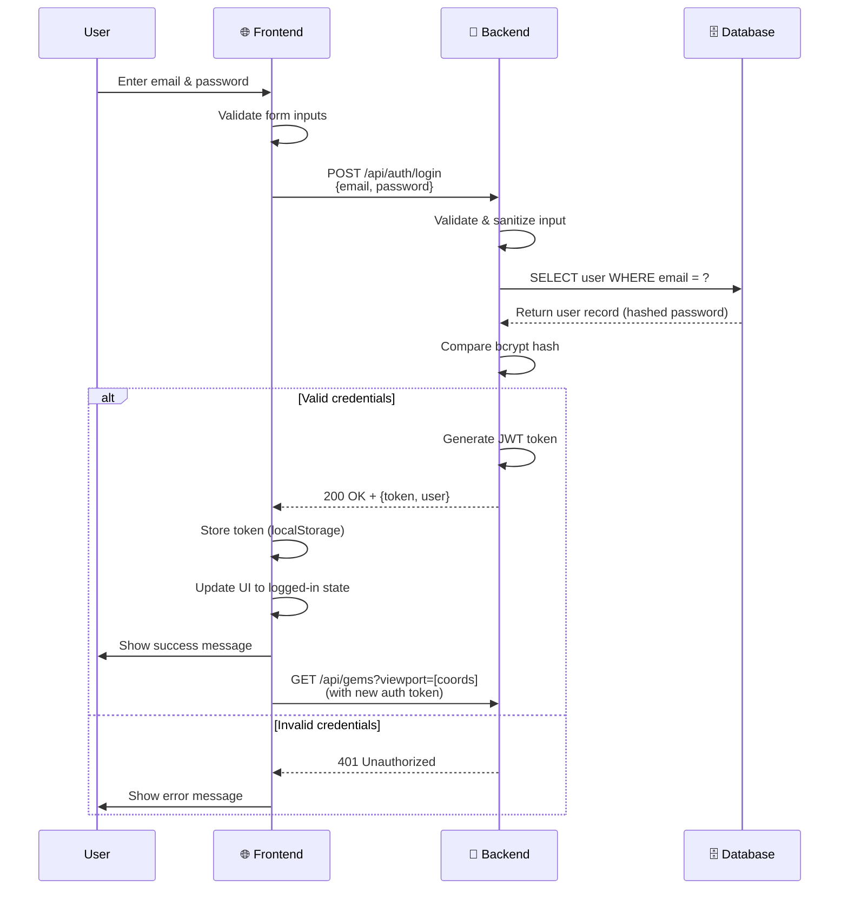

**Authentication Flow:**

```
┌─────────────────────────────────────────────────────────┐
│  🔐 Authentication Process                              │
├─────────────────────────────────────────────────────────┤
│  1. User submits credentials                            │
│  2. Backend validates against DB (bcrypt)               │
│  3. Generate JWT token (if valid)                       │
│  4. Frontend stores token securely                      │
│  5. Include token in all subsequent requests            │
│                                                          │
│  Token Structure:                                       │
│  Header: { alg: "HS256", typ: "JWT" }                  │
│  Payload: { userId, email, exp, iat }                  │
│  Signature: HMACSHA256(header + payload + secret)      │
└─────────────────────────────────────────────────────────┘
```

---

### 3️⃣ User Registration

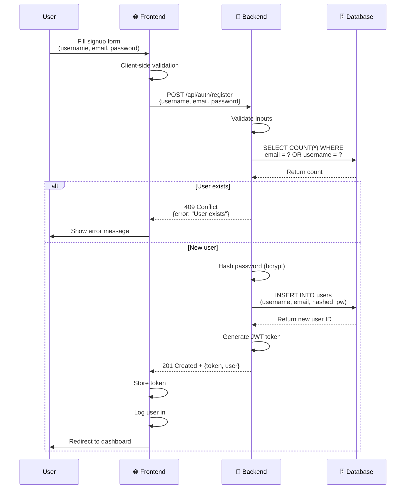

---

### 4️⃣ Pin a New Gem - Happy Path (No Duplicate)

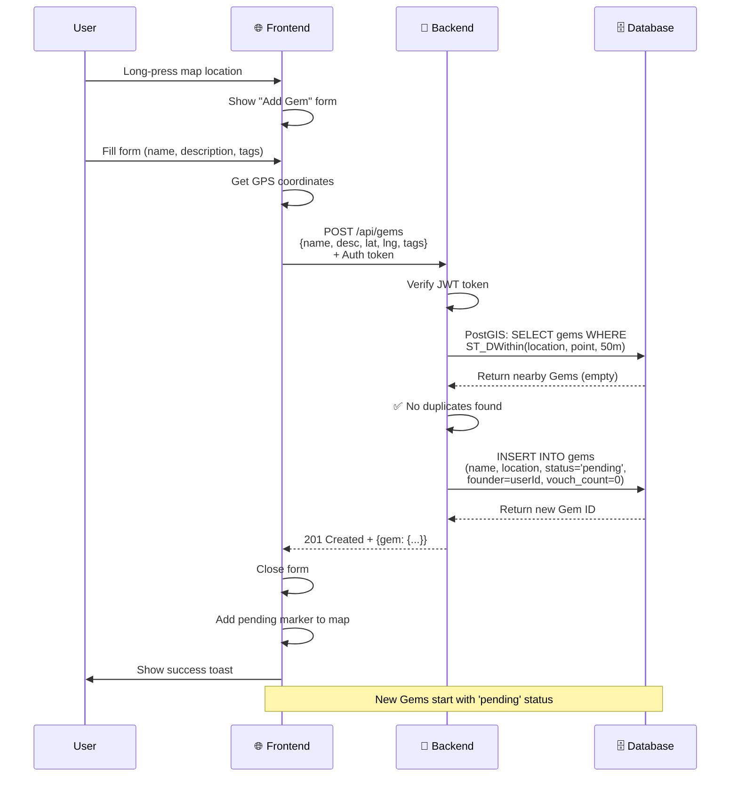

**Gem Creation Flow:**

```
┌──────────────────────────────────────────────────────┐
│  📍 Gem Lifecycle                                    │
├──────────────────────────────────────────────────────┤
│                                                      │
│  1. User pins location → status: 'pending'          │
│  2. Founder gets 1 auto-vouch                       │
│  3. Needs 2 more vouches to become 'active'         │
│  4. Active Gems appear to all users                 │
│  5. Can be rated, added to Krawls                   │
│                                                      │
│  Status Flow:                                       │
│  pending → active → flagged → removed               │
│     │        │        │                             │
│     └────────┴────────┴──> reported_count           │
│                                                      │
└──────────────────────────────────────────────────────┘
```

---

### 5️⃣ Pin a New Gem - Duplicate Found

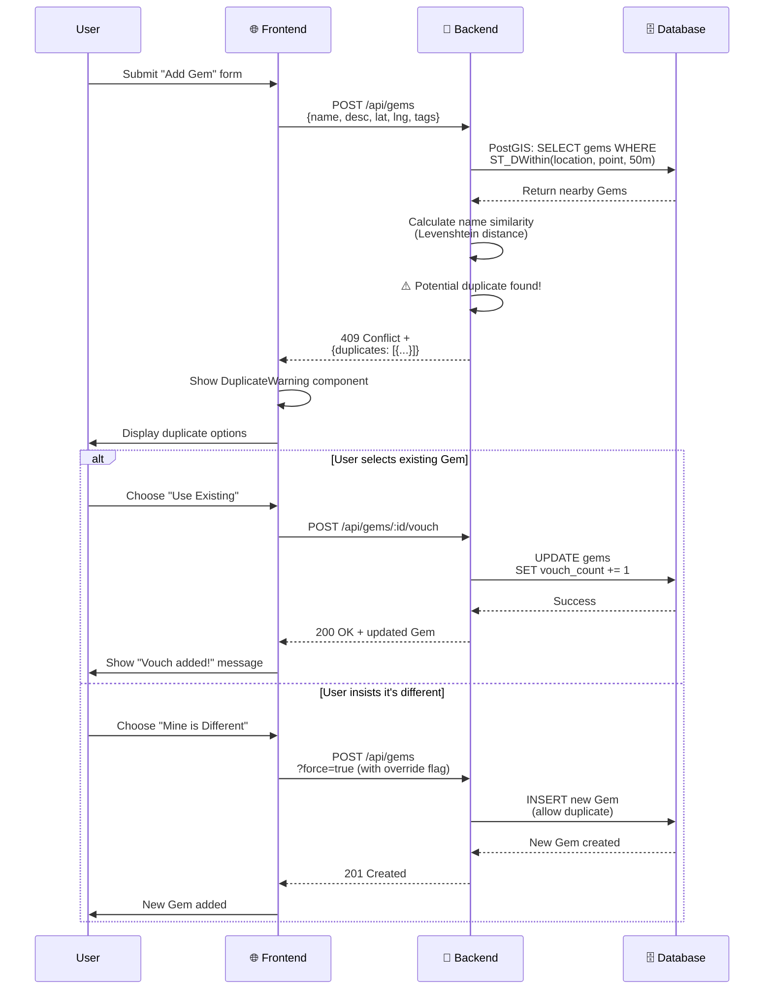

**Duplicate Detection Algorithm:**

```javascript
// Pseudocode for duplicate detection
function checkDuplicates(newGem) {
  // Step 1: Spatial Query (50m radius)
  nearbyGems = db.query(`
    SELECT * FROM gems 
    WHERE ST_DWithin(
      location::geography, 
      ST_Point($lng, $lat)::geography, 
      50
    )
  `);
  
  // Step 2: Name Similarity (Levenshtein)
  const SIMILARITY_THRESHOLD = 0.8;
  duplicates = nearbyGems.filter(gem => {
    similarity = levenshteinSimilarity(
      normalize(newGem.name),
      normalize(gem.name)
    );
    return similarity >= SIMILARITY_THRESHOLD;
  });
  
  // Step 3: Return results
  if (duplicates.length > 0) {
    return { isDuplicate: true, matches: duplicates };
  }
  return { isDuplicate: false };
}
```

---

### 6️⃣ View Krawl Details (`/krawl/:id`)

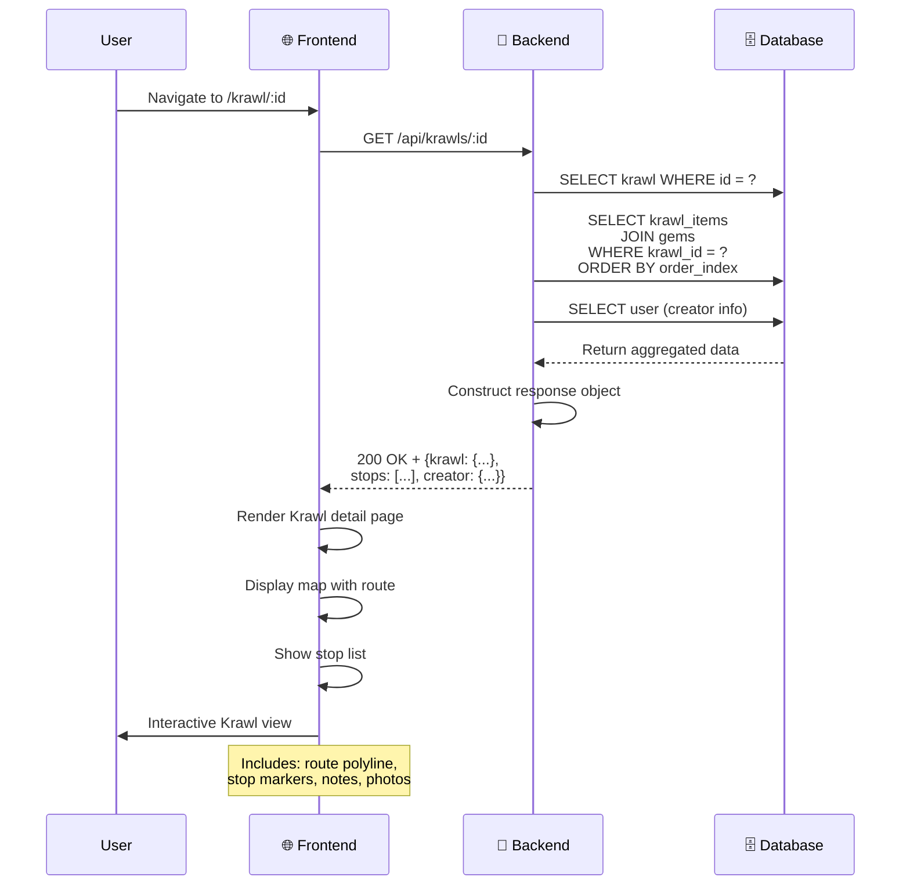

**Krawl Data Structure:**

```json
{
  "id": "uuid-123",
  "name": "Hidden Coffee Gems of Downtown",
  "description": "A tour of the best indie coffee spots",
  "creator": {
    "id": "user-456",
    "username": "coffeelover",
    "avatar": "/avatars/user-456.jpg"
  },
  "stats": {
    "totalStops": 5,
    "distance": "3.2 km",
    "estimatedTime": "2 hours",
    "rating": 4.8,
    "completionCount": 127
  },
  "stops": [
    {
      "orderIndex": 0,
      "gem": {
        "id": "gem-789",
        "name": "Espresso Lab",
        "location": { "lat": 40.7128, "lng": -74.0060 },
        "rating": 4.9
      },
      "creatorNote": "Start here! Best pour-over in the city.",
      "photos": ["/photos/gem-789-1.jpg"]
    }
    // ... more stops
  ],
  "isDownloaded": false,
  "tags": ["coffee", "downtown", "walking"]
}
```

---

### 7️⃣ Start Krawl Mode

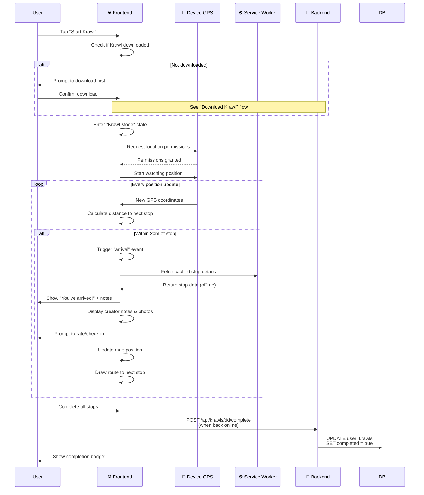

**Krawl Mode Features:**

| Feature | Description | Offline Support |
|---------|-------------|----------------|
| 🗺️ **Navigation** | Turn-by-turn to each stop | ✅ Yes (cached tiles) |
| 📍 **GPS Tracking** | Real-time position updates | ✅ Yes (device GPS) |
| 🎯 **Proximity Detection** | Alert when near stops (20m) | ✅ Yes |
| 📝 **Stop Details** | View creator notes & photos | ✅ Yes (cached) |
| ⭐ **Rate Stops** | Rate individual Gems | ❌ Queued for online |
| ✅ **Check-ins** | Mark stops as visited | ✅ Yes (local storage) |
| 🏆 **Completion** | Badge when all stops visited | ❌ Synced when online |

---

### 8️⃣ Download Krawl for Offline Use

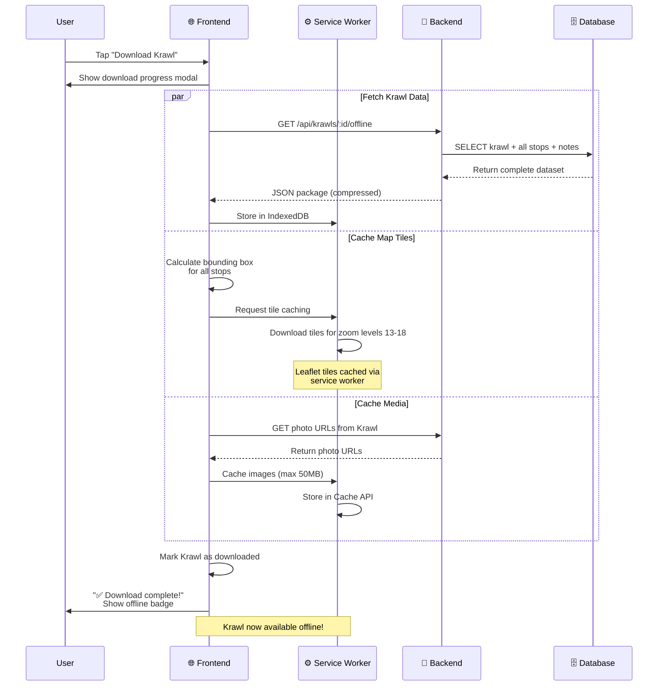

**Offline Storage Strategy:**

```
┌─────────────────────────────────────────────────────────┐
│  💾 PWA Offline Storage Breakdown                       │
├─────────────────────────────────────────────────────────┤
│                                                          │
│  📦 IndexedDB (~50 MB)                                  │
│  ├─ Krawl metadata (JSON)                               │
│  ├─ Stop details & notes                                │
│  └─ User preferences                                    │
│                                                          │
│  🗺️ Cache API (~100 MB)                                 │
│  ├─ Map tiles (zoom 13-18)                             │
│  ├─ Static images (photos)                             │
│  └─ App shell resources                                 │
│                                                          │
│  🔄 LocalStorage (~5 MB)                                │
│  ├─ Auth tokens                                         │
│  ├─ User settings                                       │
│  └─ Pending actions queue                               │
│                                                          │
│  Total: ~155 MB per Krawl                               │
│                                                          │
└─────────────────────────────────────────────────────────┘
```

**Service Worker Caching Logic:**

```javascript
// Service Worker cache strategy
self.addEventListener('fetch', (event) => {
  const { request } = event;
  
  // API requests: Network first, cache fallback
  if (request.url.includes('/api/')) {
    event.respondWith(
      fetch(request)
        .then(response => {
          // Clone & cache successful responses
          const cache = caches.open('api-cache');
          cache.put(request, response.clone());
          return response;
        })
        .catch(() => caches.match(request)) // Fallback to cache
    );
  }
  
  // Map tiles: Cache first, network fallback
  if (request.url.includes('/tiles/')) {
    event.respondWith(
      caches.match(request)
        .then(cached => cached || fetch(request))
    );
  }
  
  // Static assets: Cache only
  if (request.url.includes('/static/')) {
    event.respondWith(
      caches.match(request)
    );
  }
});
```

---

## 🔐 Security Considerations

### Authentication & Authorization

| Layer | Security Measure | Implementation |
|-------|-----------------|----------------|
| **Frontend** | Token storage | HttpOnly cookies or secure localStorage |
| **Transport** | HTTPS only | Force SSL/TLS 1.3+ |
| **Backend** | JWT validation | Verify signature on every request |
| **Backend** | Password hashing | bcrypt with cost factor 12 |
| **Database** | Prepared statements | Prevent SQL injection |
| **API** | Rate limiting | Max 100 req/min per IP |

### Data Privacy

```
┌──────────────────────────────────────────────────┐
│  🔒 Privacy & Data Protection                    │
├──────────────────────────────────────────────────┤
│                                                  │
│  User Data:                                      │
│  ✓ Passwords: bcrypt hashed (never stored plain) │
│  ✓ Email: Encrypted at rest                     │
│  ✓ GPS data: Not stored on server               │
│  ✓ Device info: Anonymized                      │
│                                                  │
│  Location Data:                                  │
│  ✓ Gems: Public coordinates only                │
│  ✓ User location: Client-side only              │
│  ✓ No tracking of movement patterns             │
│                                                  │
│  GDPR Compliance:                                │
│  ✓ Right to be forgotten                        │
│  ✓ Data export available                        │
│  ✓ Opt-in for analytics                         │
│                                                  │
└──────────────────────────────────────────────────┘
```

---

## 🚀 Performance Optimizations

### Database Indexing

```sql
-- Critical indexes for performance
CREATE INDEX idx_gems_location 
  ON gems USING GIST(location);

CREATE INDEX idx_gems_status 
  ON gems(status) WHERE status = 'active';

CREATE INDEX idx_krawl_items_krawl_order 
  ON krawl_items(krawl_id, order_index);

CREATE INDEX idx_ratings_gem 
  ON ratings(gem_id);

-- Full-text search
CREATE INDEX idx_gems_search 
  ON gems USING GIN(to_tsvector('english', name || ' ' || description));
```

### Caching Strategy

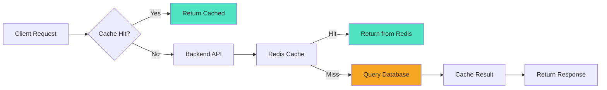

**Cache TTL (Time-to-Live):**

| Resource | TTL | Invalidation Strategy |
|----------|-----|----------------------|
| Gem list (viewport) | 5 minutes | On new Gem in area |
| Gem details | 15 minutes | On update/rating |
| Krawl list | 10 minutes | On new Krawl |
| Krawl details | 30 minutes | On edit |
| User profile | 1 hour | On profile update |
| Static assets | 7 days | On version bump |

---

## 📊 Monitoring & Analytics

### Key Metrics to Track

```
┌────────────────────────────────────────────────┐
│  📈 Application Metrics                        │
├────────────────────────────────────────────────┤
│                                                │
│  Performance:                                  │
│  • API response time (p50, p95, p99)          │
│  • Database query time                         │
│  • Map tile load time                         │
│  • PWA cache hit rate                         │
│                                                │
│  Usage:                                        │
│  • Active users (DAU/MAU)                     │
│  • Gems created per day                       │
│  • Krawls completed                           │
│  • Average Krawl rating                       │
│                                                │
│  Errors:                                       │
│  • API error rate (4xx, 5xx)                  │
│  • Failed Gem submissions                     │
│  • GPS permission denials                     │
│  • Offline sync failures                      │
│                                                │
└────────────────────────────────────────────────┘
```

---

## 🔄 State Management

### Frontend State Architecture

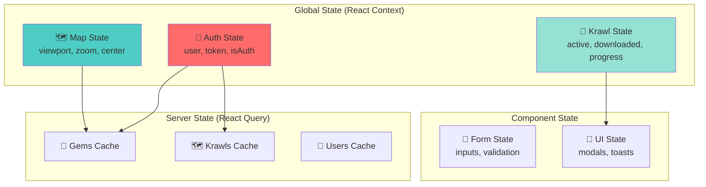

---

## 🌐 API Endpoints Summary

### Authentication Endpoints

```http
POST   /api/auth/register      # Create new user account
POST   /api/auth/login          # Authenticate user
POST   /api/auth/logout         # Invalidate token
POST   /api/auth/refresh        # Refresh JWT token
GET    /api/auth/me             # Get current user info
```

### Gem Endpoints

```http
GET    /api/gems                # List gems (with viewport filter)
GET    /api/gems/:id            # Get gem details
POST   /api/gems                # Create new gem
PUT    /api/gems/:id            # Update gem (creator only)
DELETE /api/gems/:id            # Delete gem (creator only)
POST   /api/gems/:id/vouch      # Vouch for gem
POST   /api/gems/:id/rate       # Rate gem
GET    /api/gems/:id/ratings    # Get gem ratings
POST   /api/gems/:id/report     # Report inappropriate gem
```

### Krawl Endpoints

```http
GET    /api/krawls              # List public krawls
GET    /api/krawls/:id          # Get krawl details
POST   /api/krawls              # Create new krawl
PUT    /api/krawls/:id          # Update krawl (creator only)
DELETE /api/krawls/:id          # Delete krawl (creator only)
GET    /api/krawls/:id/offline  # Get offline package
POST   /api/krawls/:id/complete # Mark krawl as completed
POST   /api/krawls/:id/rate     # Rate krawl
```

### User Endpoints

```http
GET    /api/users/:id           # Get user profile
PUT    /api/users/:id           # Update profile (self only)
GET    /api/users/:id/gems      # Get user's gems
GET    /api/users/:id/krawls    # Get user's krawls
GET    /api/users/:id/completed # Get completed krawls
```

---

## 🎯 Design Principles

### 1. **Offline-First Architecture**
- All critical features work without internet
- Background sync when connection restored
- Progressive enhancement approach

### 2. **Mobile-First Design**
- Touch-optimized interface
- Responsive breakpoints
- Native-like interactions

### 3. **Performance-Driven**
- Lazy loading for routes
- Image optimization
- Minimal bundle size
- Efficient caching

### 4. **Scalability**
- Stateless API design
- Horizontal scaling ready
- Microservices-friendly
- Database sharding possible

### 5. **Security by Default**
- HTTPS enforced
- Input validation everywhere
- Rate limiting
- CORS properly configured

---

## 📝 Notes

- **PostGIS Queries:** All spatial queries use geography type for accurate distance calculations in meters.
- **JWT Expiration:** Tokens expire after 24 hours; refresh tokens last 30 days.
- **Gem Status:** Only 'active' gems are shown to non-authenticated users.
- **Map Tiles:** Using OpenStreetMap tiles with proper attribution.
- **Offline Sync:** Queued actions are automatically synced when connection is restored.
- **Rate Limiting:** API rate limits are per-user for authenticated requests, per-IP for anonymous.

---

## 🔮 Future Considerations

- **Real-time Features:** WebSocket support for live Gem updates
- **Social Features:** Follow users, social feed, comments
- **Gamification:** Badges, leaderboards, achievements
- **AR Mode:** Augmented reality gem discovery
- **Multi-language:** i18n support for global audience
- **Admin Panel:** Content moderation dashboard
- **Analytics Dashboard:** Creator insights and stats
- **Monetization:** Premium Krawls, sponsored Gems

---

## 📝 Changelog

| Version | Date | Changes | Author |
|---------|------|---------|--------|
| 1.0.0 | 2025-10-28 | Initial system design documentation | Development Team |

---

## 📚 Related Documents

- [System Architecture](./system-architecture.md) - High-level architecture diagram
- [Database Schema](./database-schema.md) - Database design and schema
- [API Documentation](./api-documentation.md) - API endpoints and specifications
- [Tech Stack](./tech-stack.md) - Technology choices
- [Security Plan](./security-plan.md) - Security implementation details
- [Project Setup](./project-setup.md) - Development environment setup

---

<div align="center">

**Built with ❤️ for urban explorers**

</div>

---

*Document maintained by Development Team • Last reviewed: 2025-10-28*

